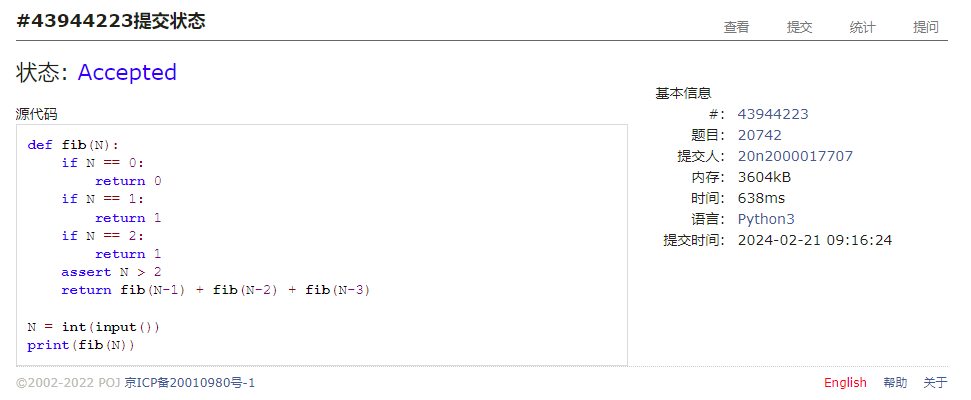
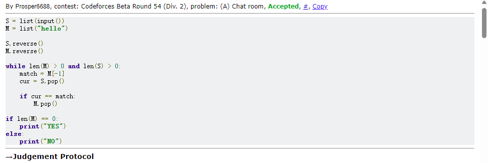
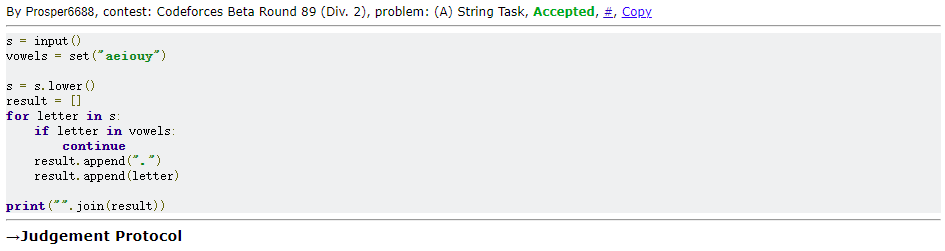
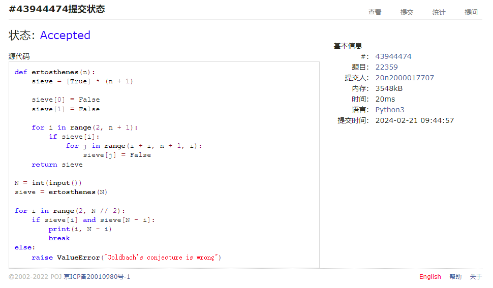
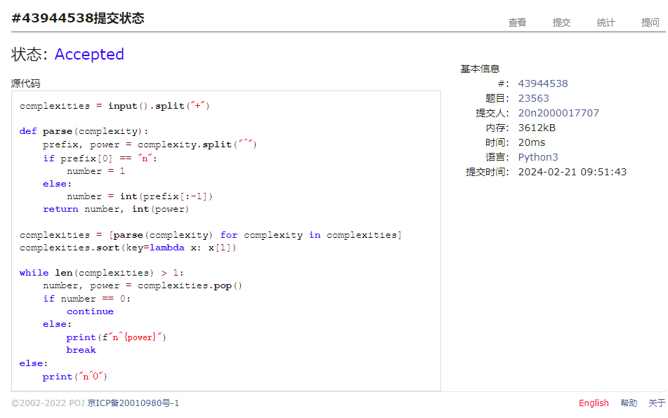
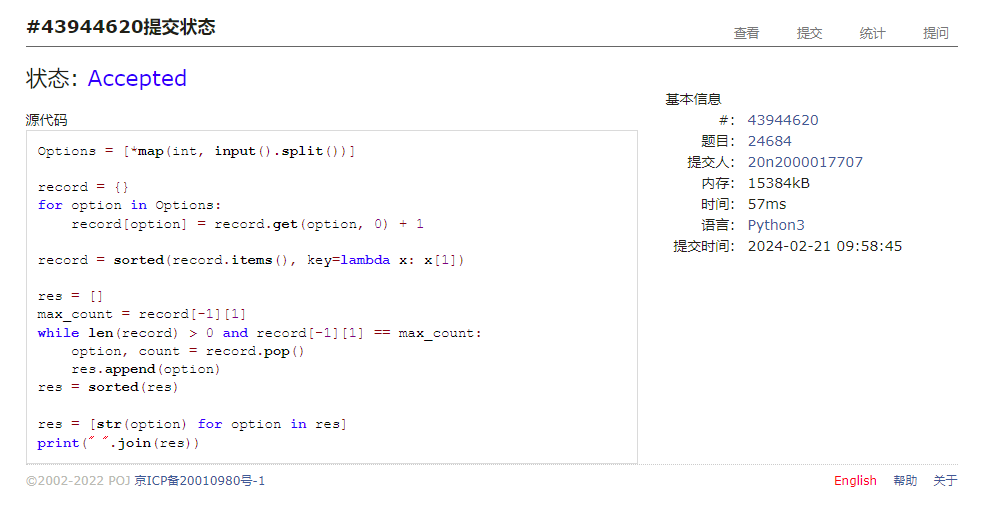

# Assignment #1: 拉齐大家Python水平

Updated 0940 GMT+8 Feb 19, 2024

2024 spring, Complied by Cat2Li

**说明：**

1）数算课程的先修课是计概，由于计概学习中可能使用了不同的编程语言，而数算课程要求Python语言，因此第一周作业练习Python编程。如果有同学坚持使用C/C++，也可以，但是建议也要会Python语言。

2）请把每个题目解题思路（可选），源码Python, 或者C++（已经在Codeforces/Openjudge上AC），截图（包含Accepted），填写到下面作业模版中（推荐使用 typora <https://typoraio.cn> ，或者用word）。AC 或者没有AC，都请标上每个题目大致花费时间。

3）课程网站是Canvas平台, <https://pku.instructure.com>, 学校通知3月1日导入选课名单后启用。**作业写好后，保留在自己手中，待3月1日提交。**

提交时候先提交pdf文件，再把md或者doc文件上传到右侧“作业评论”。Canvas需要有同学清晰头像、提交文件有pdf、"作业评论"区有上传的md或者doc附件。

4）如果不能在截止前提交作业，请写明原因。

**编程环境**

操作系统：Ubuntu 22.04.4 LTS

Python编程环境：VS Code 1.86.2; Python 3.12.2

C/C++编程环境：VS Code 1.86.2; gcc (Ubuntu 11.4.0-1ubuntu1~22.04) 11.4.0

## 1. 题目

### 20742: 泰波拿契數

<http://cs101.openjudge.cn/practice/20742/>

思路：

#### 代码

```python
def fib(N):
    if N == 0:
        return 0
    if N == 1:
        return 1
    if N == 2:
        return 1
    assert N > 2
    return fib(N-1) + fib(N-2) + fib(N-3)

N = int(input())
print(fib(N))
```

代码运行截图 ==（至少包含有"Accepted"）==



### 58A. Chat room

greedy/strings, 1000, <http://codeforces.com/problemset/problem/58/A>

思路：

#### 代码

```python
S = list(input())
M = list("hello")

S.reverse()
M.reverse()

while len(M) > 0 and len(S) > 0:
    match = M[-1]
    cur = S.pop()
    
    if cur == match:
        M.pop()

if len(M) == 0:
    print("YES")
else:
    print("NO")
```

代码运行截图 ==（至少包含有"Accepted"）==



### 118A. String Task

implementation/strings, 1000, <http://codeforces.com/problemset/problem/118/A>

思路：

#### 代码

```python
s = input()
vowels = set("aeiouy")

s = s.lower()
result = []
for letter in s:
    if letter in vowels:
        continue
    result.append(".")
    result.append(letter)

print("".join(result))
```

代码运行截图 ==（AC代码截图，至少包含有"Accepted"）==



### 22359: Goldbach Conjecture

<http://cs101.openjudge.cn/practice/22359/>

思路：

#### 代码

```python
def ertosthenes(n):
    sieve = [True] * (n + 1)
    
    sieve[0] = False
    sieve[1] = False
    
    for i in range(2, n + 1):
        if sieve[i]:
            for j in range(i + i, n + 1, i):
                sieve[j] = False
    return sieve

N = int(input())
sieve = ertosthenes(N)

for i in range(2, N // 2):
    if sieve[i] and sieve[N - i]:
        print(i, N - i)
        break
else:
    raise ValueError("Goldbach's conjecture is wrong")
```

代码运行截图 ==（AC代码截图，至少包含有"Accepted"）==



### 23563: 多项式时间复杂度

<http://cs101.openjudge.cn/practice/23563/>

思路：

#### 代码

```python
complexities = input().split("+")

def parse(complexity):
    prefix, power = complexity.split("^")
    if prefix[0] == "n":
        number = 1
    else:
        number = int(prefix[:-1])
    return number, int(power)

complexities = [parse(complexity) for complexity in complexities]
complexities.sort(key=lambda x: x[1])

while len(complexities) > 1:
    number, power = complexities.pop()
    if number == 0:
        continue
    else:
        print(f"n^{power}")
        break
else:
    print("n^0")
```

代码运行截图 ==（AC代码截图，至少包含有"Accepted"）==



### 24684: 直播计票

<http://cs101.openjudge.cn/practice/24684/>

思路：

#### 代码

```python
Options = [*map(int, input().split())]

record = {}
for option in Options:
    record[option] = record.get(option, 0) + 1
    
record = sorted(record.items(), key=lambda x: x[1])

res = []
max_count = record[-1][1]
while len(record) > 0 and record[-1][1] == max_count:
    option, count = record.pop()
    res.append(option)
res = sorted(res)

res = [str(option) for option in res]
print(" ".join(res))
```

代码运行截图 ==（AC代码截图，至少包含有"Accepted"）==



## 2. 学习总结和收获

==如果作业题目简单，有否额外练习题目，比如：OJ“数算pre每日选做”、CF、LeetCode、洛谷等网站题目。==

复习了 Python 基础知识，感觉良好。
