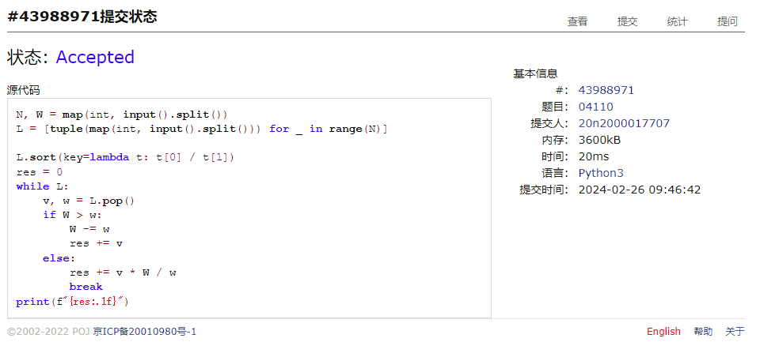
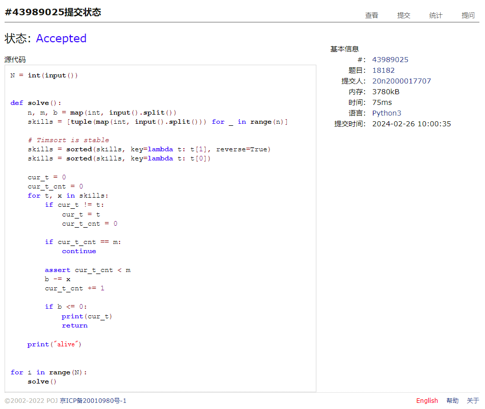
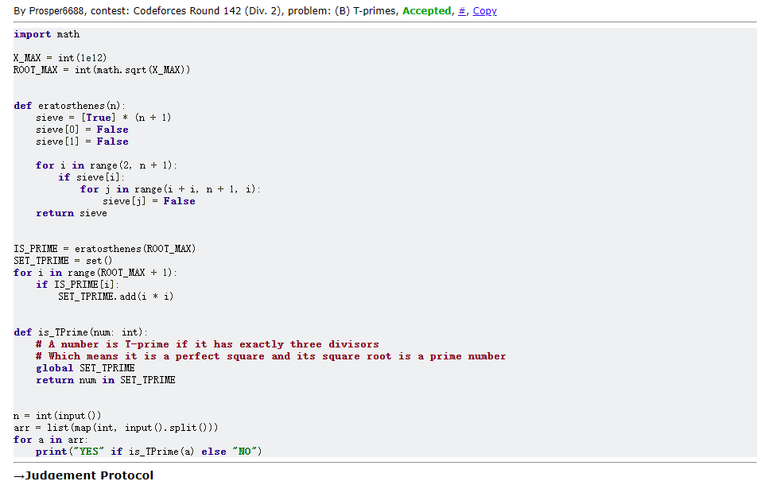
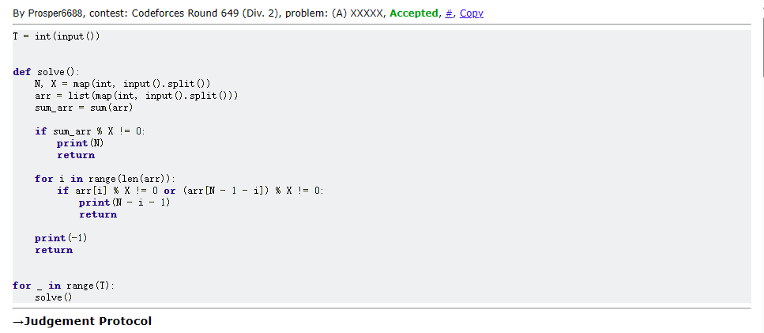
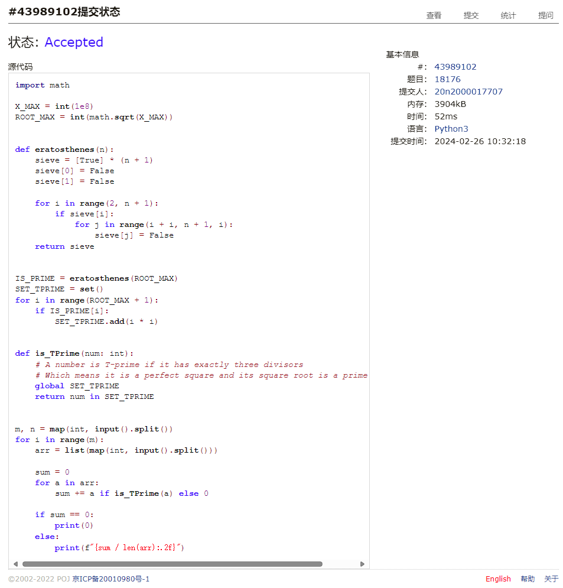

# Assignment #2: 编程练习

Updated 0953 GMT+8 Feb 24, 2024

2024 spring, Complied by Cat2Li

**说明：**

1）The complete process to learn DSA from scratch can be broken into 4 parts:

- Learn about Time and Space complexities
- Learn the basics of individual Data Structures
- Learn the basics of Algorithms
- Practice Problems on DSA

2）请把每个题目解题思路（可选），源码Python, 或者C++（已经在Codeforces/Openjudge上AC），截图（包含Accepted），填写到下面作业模版中（推荐使用 typora <https://typoraio.cn> ，或者用word）。AC 或者没有AC，都请标上每个题目大致花费时间。

3）课程网站是Canvas平台, <https://pku.instructure.com>, 学校通知3月1日导入选课名单后启用。**作业写好后，保留在自己手中，待3月1日提交。**

提交时候先提交pdf文件，再把md或者doc文件上传到右侧“作业评论”。Canvas需要有同学清晰头像、提交文件有pdf、"作业评论"区有上传的md或者doc附件。

4）如果不能在截止前提交作业，请写明原因。

**编程环境**

操作系统：Ubuntu 22.04.4 LTS

Python编程环境：VS Code 1.86.2; Python 3.12.2

C/C++编程环境：VS Code 1.86.2; gcc (Ubuntu 11.4.0-1ubuntu1~22.04) 11.4.0

## 1. 题目

### 27653: Fraction类

<http://cs101.openjudge.cn/practice/27653/>

思路：

##### 代码

```python
from __future__ import annotations
from numbers import Number


class Fraction(object):

    @staticmethod
    def sgn(num: Number):
        if num > 0:
            return 1
        elif num < 0:
            return -1
        else:
            return 0

    @staticmethod
    def gcd(a: int, b: int):
        while b:
            a, b = b, a % b
        return a

    def __init__(self, num: int, den: int):
        assert isinstance(num, int)
        assert isinstance(den, int)

        self.sign = self.sgn(num) * self.sgn(den)

        self.num = abs(num)
        self.den = abs(den)

        if self.num == 0:
            self.den = 1
        else:
            g = self.gcd(self.num, self.den)
            self.num //= g
            self.den //= g

    def __str__(self):
        return str(self.sign * self.num) + '/' + str(self.den)

    def __add__(self, other: Fraction):
        return Fraction(
            self.sign * self.num * other.den +
            other.sign * other.num * self.den, self.den * other.den)

    def __sub__(self, other: Fraction):
        return Fraction(
            self.sign * self.num * other.den -
            other.sign * other.num * self.den, self.den * other.den)

    def __mul__(self, other: Fraction):
        return Fraction(self.sign * other.sign * self.num * other.num,
                        self.den * other.den)

    def __div__(self, other: Fraction):
        return Fraction(self.sign * other.sign * self.num * other.den,
                        self.den * other.num)

    def __eq__(self, other: Fraction):
        return self.sign * self.num * other.den == other.sign * other.num * self.den


num_1, den_1, num_2, den_2 = map(int, input().split())
f1 = Fraction(num_1, den_1)
f2 = Fraction(num_2, den_2)
print(f1 + f2)

```

代码运行截图 ==（至少包含有"Accepted"）==


### 04110: 圣诞老人的礼物-Santa Clau’s Gifts

greedy/dp, <http://cs101.openjudge.cn/practice/04110>

思路：

##### 代码

```python
N, W = map(int, input().split())
L = [tuple(map(int, input().split())) for _ in range(N)]

L.sort(key=lambda t: t[0] / t[1])
res = 0
while L:
    v, w = L.pop()
    if W > w:
        W -= w
        res += v
    else:
        res += v * W / w
        break
print(f"{res:.1f}")

```

代码运行截图 ==（至少包含有"Accepted"）==



### 18182: 打怪兽

implementation/sortings/data structures, <http://cs101.openjudge.cn/practice/18182/>

思路：

利用 Timsort 的稳定性，两次排序后按照先后顺序遍历列表即可

##### 代码

```python
N = int(input())


def solve():
    n, m, b = map(int, input().split())
    skills = [tuple(map(int, input().split())) for _ in range(n)]

    # Timsort is stable
    skills = sorted(skills, key=lambda t: t[1], reverse=True)
    skills = sorted(skills, key=lambda t: t[0])

    cur_t = 0
    cur_t_cnt = 0
    for t, x in skills:
        if cur_t != t:
            cur_t = t
            cur_t_cnt = 0

        if cur_t_cnt == m:
            continue

        assert cur_t_cnt < m
        b -= x
        cur_t_cnt += 1

        if b <= 0:
            print(cur_t)
            return

    print("alive")


for i in range(N):
    solve()

```

代码运行截图 ==（AC代码截图，至少包含有"Accepted"）==



### 230B. T-primes

binary search/implementation/math/number theory, 1300, <http://codeforces.com/problemset/problem/230/B>

思路：

##### 代码

```python
import math

X_MAX = int(1e12)
ROOT_MAX = int(math.sqrt(X_MAX))


def eratosthenes(n):
    sieve = [True] * (n + 1)
    sieve[0] = False
    sieve[1] = False

    for i in range(2, n + 1):
        if sieve[i]:
            for j in range(i + i, n + 1, i):
                sieve[j] = False
    return sieve


IS_PRIME = eratosthenes(ROOT_MAX)
SET_TPRIME = set()
for i in range(ROOT_MAX + 1):
    if IS_PRIME[i]:
        SET_TPRIME.add(i * i)


def is_TPrime(num: int):
    # A number is T-prime if it has exactly three divisors
    # Which means it is a perfect square and its square root is a prime number
    global SET_TPRIME
    return num in SET_TPRIME


n = int(input())
arr = list(map(int, input().split()))
for a in arr:
    print("YES" if is_TPrime(a) else "NO")

```

代码运行截图 ==（AC代码截图，至少包含有"Accepted"）==



### 1364A. XXXXX

brute force/data structures/number theory/two pointers, 1200, <https://codeforces.com/problemset/problem/1364/A>

思路：

##### 代码

```python
T = int(input())


def solve():
    N, X = map(int, input().split())
    arr = list(map(int, input().split()))
    sum_arr = sum(arr)

    if sum_arr % X != 0:
        print(N)
        return

    for i in range(len(arr)):
        if arr[i] % X != 0 or (arr[N - 1 - i]) % X != 0:
            print(N - i - 1)
            return

    print(-1)
    return


for _ in range(T):
    solve()

```

代码运行截图 ==（AC代码截图，至少包含有"Accepted"）==



### 18176: 2050年成绩计算

<http://cs101.openjudge.cn/practice/18176/>

思路：

##### 代码

```python
import math

X_MAX = int(1e8)
ROOT_MAX = int(math.sqrt(X_MAX))


def eratosthenes(n):
    sieve = [True] * (n + 1)
    sieve[0] = False
    sieve[1] = False

    for i in range(2, n + 1):
        if sieve[i]:
            for j in range(i + i, n + 1, i):
                sieve[j] = False
    return sieve


IS_PRIME = eratosthenes(ROOT_MAX)
SET_TPRIME = set()
for i in range(ROOT_MAX + 1):
    if IS_PRIME[i]:
        SET_TPRIME.add(i * i)


def is_TPrime(num: int):
    # A number is T-prime if it has exactly three divisors
    # Which means it is a perfect square and its square root is a prime number
    global SET_TPRIME
    return num in SET_TPRIME


m, n = map(int, input().split())
for i in range(m):
    arr = list(map(int, input().split()))

    sum = 0
    for a in arr:
        sum += a if is_TPrime(a) else 0

    if sum == 0:
        print(0)
    else:
        print(f"{sum / len(arr):.2f}")

```

代码运行截图 ==（AC代码截图，至少包含有"Accepted"）==



## 2. 学习总结和收获

==如果作业题目简单，有否额外练习题目，比如：OJ“2024spring每日选做”、CF、LeetCode、洛谷等网站题目。==

复习了 Python 基础知识，感觉良好。
