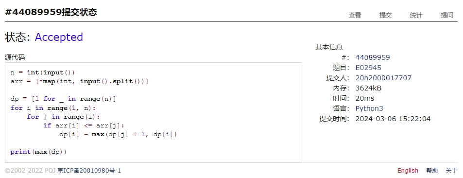
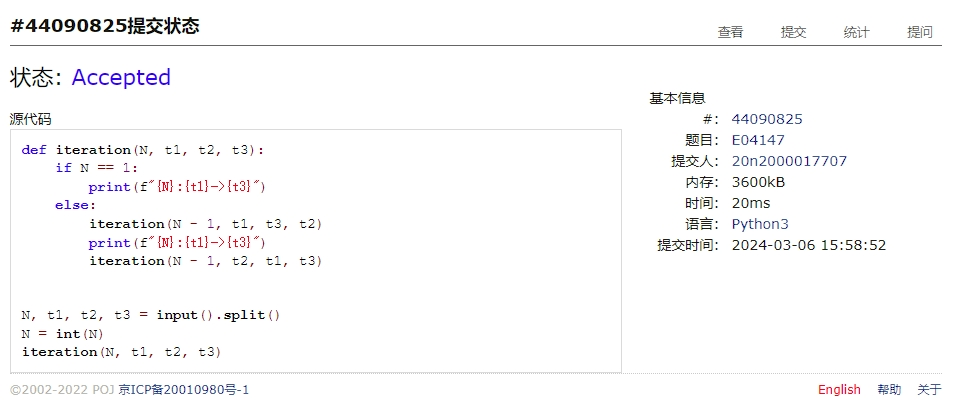
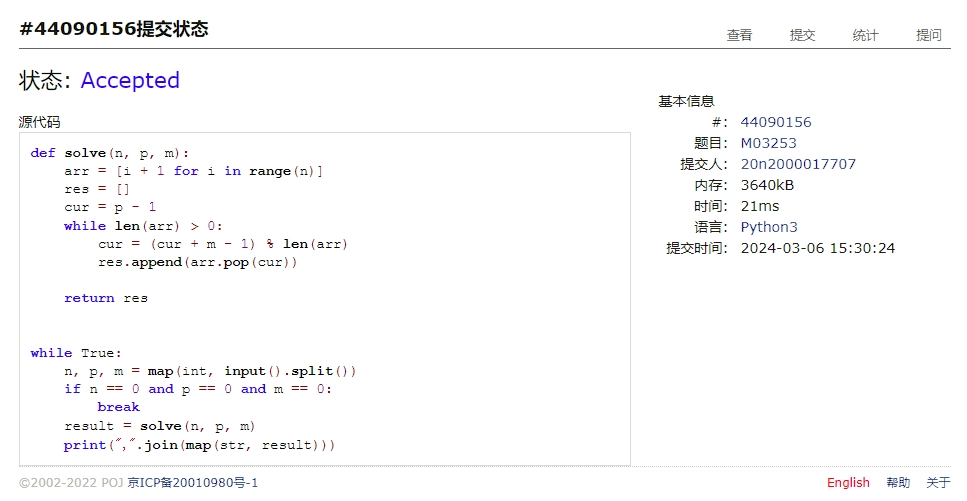
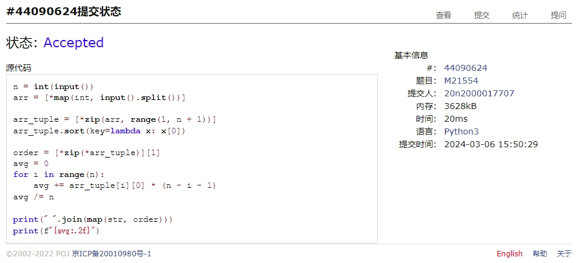
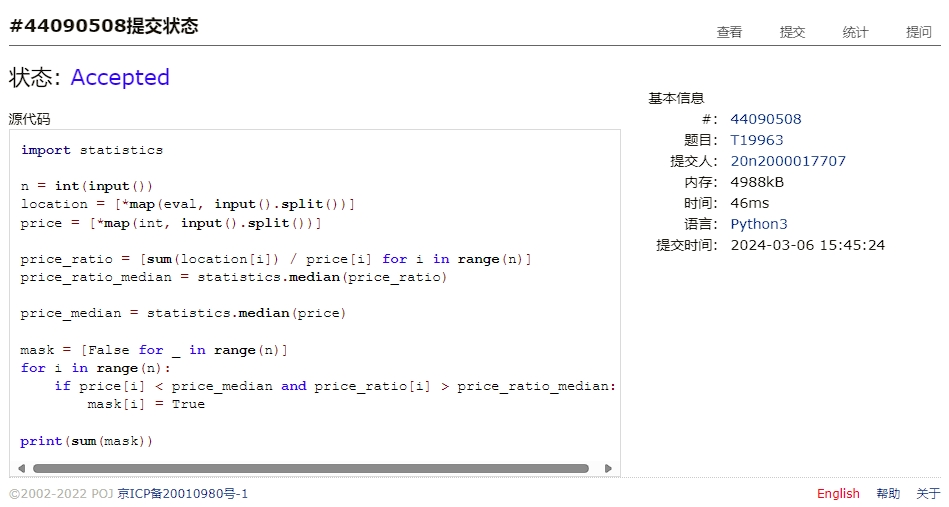
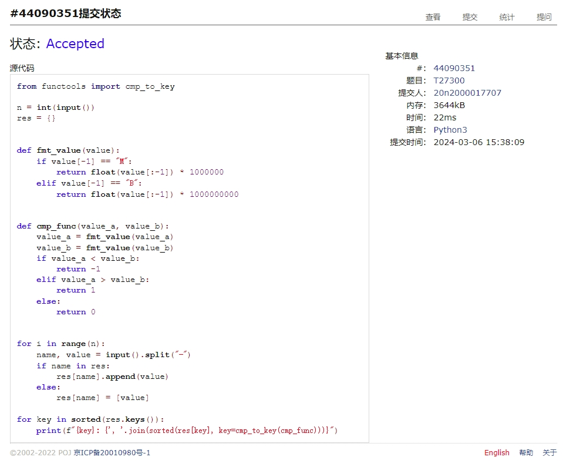

# Assignment #3: March月考

Updated 1537 GMT+8 March 6, 2024

2024 spring, Complied by Cat2Li

**说明：**

1）The complete process to learn DSA from scratch can be broken into 4 parts:

- Learn about Time and Space complexities
- Learn the basics of individual Data Structures
- Learn the basics of Algorithms
- Practice Problems on DSA

2）请把每个题目解题思路（可选），源码Python, 或者C++（已经在Codeforces/Openjudge上AC），截图（包含Accepted），填写到下面作业模版中（推荐使用 typora <https://typoraio.cn> ，或者用word）。AC 或者没有AC，都请标上每个题目大致花费时间。

3）提交时候先提交pdf文件，再把md或者doc文件上传到右侧“作业评论”。Canvas需要有同学清晰头像、提交文件有pdf、"作业评论"区有上传的md或者doc附件。

4）如果不能在截止前提交作业，请写明原因。

**编程环境**

==（请改为同学的操作系统、编程环境等）==

操作系统：Ubuntu 22.04.4 LTS

Python编程环境：VS Code 1.86.2; Python 3.12.2

C/C++编程环境：VS Code 1.86.2; gcc (Ubuntu 11.4.0-1ubuntu1~22.04) 11.4.0

## 1. 题目

**02945: 拦截导弹**

<http://cs101.openjudge.cn/practice/02945/>

思路：

##### 代码

```python
n = int(input())
arr = [*map(int, input().split())]

dp = [1 for _ in range(n)]
for i in range(1, n):
    for j in range(i):
        if arr[i] <= arr[j]:
            dp[i] = max(dp[j] + 1, dp[i])

print(max(dp))
```

代码运行截图 ==（至少包含有"Accepted"）==


**04147:汉诺塔问题(Tower of Hanoi)**

<http://cs101.openjudge.cn/practice/04147>

思路：

##### 代码

```python
def iteration(N, t1, t2, t3):
    if N == 1:
        print(f"{N}:{t1}->{t3}")
    else:
        iteration(N - 1, t1, t3, t2)
        print(f"{N}:{t1}->{t3}")
        iteration(N - 1, t2, t1, t3)


N, t1, t2, t3 = input().split()
N = int(N)
iteration(N, t1, t2, t3)
```

代码运行截图 ==（至少包含有"Accepted"）==


**03253: 约瑟夫问题No.2**

<http://cs101.openjudge.cn/practice/03253>

思路：

##### 代码

```python
def solve(n, p, m):
    arr = [i + 1 for i in range(n)]
    res = []
    cur = p - 1
    while len(arr) > 0:
        cur = (cur + m - 1) % len(arr)
        res.append(arr.pop(cur))

    return res


while True:
    n, p, m = map(int, input().split())
    if n == 0 and p == 0 and m == 0:
        break
    result = solve(n, p, m)
    print(",".join(map(str, result)))
```

代码运行截图 ==（AC代码截图，至少包含有"Accepted"）==


**21554:排队做实验 (greedy)v0.2**

<http://cs101.openjudge.cn/practice/21554>

思路：

##### 代码

```python
n = int(input())
arr = [*map(int, input().split())]

arr_tuple = [*zip(arr, range(1, n + 1))]
arr_tuple.sort(key=lambda x: x[0])

order = [*zip(*arr_tuple)][1]
avg = 0
for i in range(n):
    avg += arr_tuple[i][0] * (n - i - 1)
avg /= n

print(" ".join(map(str, order)))
print(f"{avg:.2f}")
```

代码运行截图 ==（AC代码截图，至少包含有"Accepted"）==


**19963:买学区房**

<http://cs101.openjudge.cn/practice/19963>

思路：

##### 代码

```python
import statistics

n = int(input())
location = [*map(eval, input().split())]
price = [*map(int, input().split())]

price_ratio = [sum(location[i]) / price[i] for i in range(n)]
price_ratio_median = statistics.median(price_ratio)

price_median = statistics.median(price)

mask = [False for _ in range(n)]
for i in range(n):
    if price[i] < price_median and price_ratio[i] > price_ratio_median:
        mask[i] = True

print(sum(mask))
```

代码运行截图 ==（AC代码截图，至少包含有"Accepted"）==


**27300: 模型整理**

<http://cs101.openjudge.cn/practice/27300>

思路：

##### 代码

```python
from functools import cmp_to_key

n = int(input())
res = {}


def fmt_value(value):
    if value[-1] == "M":
        return float(value[:-1]) * 1000000
    elif value[-1] == "B":
        return float(value[:-1]) * 1000000000


def cmp_func(value_a, value_b):
    value_a = fmt_value(value_a)
    value_b = fmt_value(value_b)
    if value_a < value_b:
        return -1
    elif value_a > value_b:
        return 1
    else:
        return 0


for i in range(n):
    name, value = input().split("-")
    if name in res:
        res[name].append(value)
    else:
        res[name] = [value]

for key in sorted(res.keys()):
    print(f"{key}: {', '.join(sorted(res[key], key=cmp_to_key(cmp_func)))}")
```

代码运行截图 ==（AC代码截图，至少包含有"Accepted"）==


## 2. 学习总结和收获

==如果作业题目简单，有否额外练习题目，比如：OJ“2024spring每日选做”、CF、LeetCode、洛谷等网站题目。==

复习了 Python 基础知识，感觉良好。
