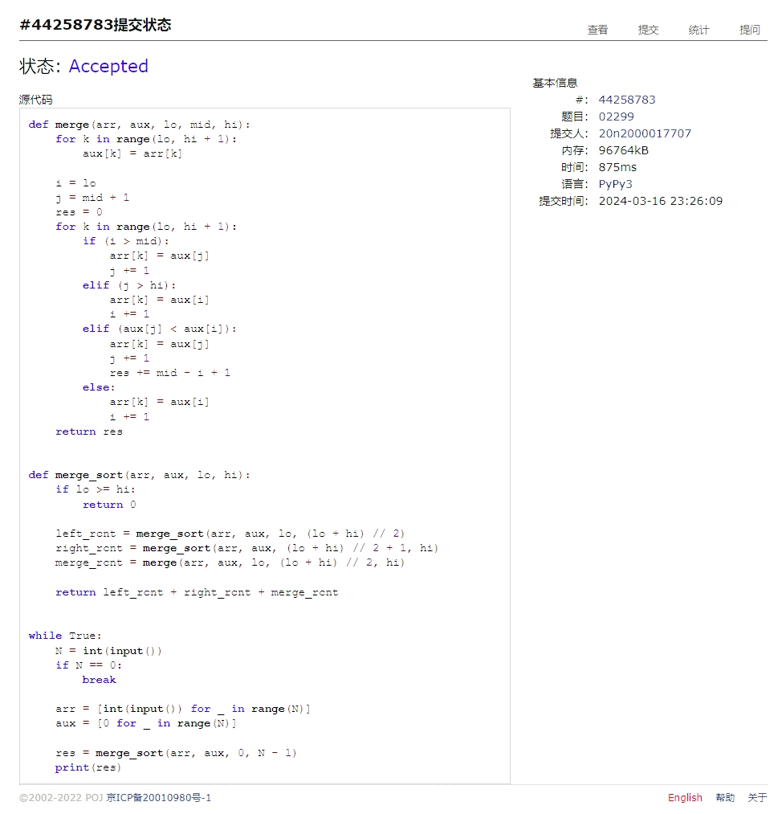

# Assignment #4: 排序、栈、队列和树

Updated 0005 GMT+8 March 11, 2024

2024 spring, Complied by Cat2Li

**说明：**

1）The complete process to learn DSA from scratch can be broken into 4 parts:

Learn about Time complexities, learn the basics of individual Data Structures, learn the basics of Algorithms, and practice Problems.

2）请把每个题目解题思路（可选），源码Python, 或者C++（已经在Codeforces/Openjudge上AC），截图（包含Accepted），填写到下面作业模版中（推荐使用 typora <https://typoraio.cn> ，或者用word）。AC 或者没有AC，都请标上每个题目大致花费时间。

3）提交时候先提交pdf文件，再把md或者doc文件上传到右侧“作业评论”。Canvas需要有同学清晰头像、提交文件有pdf、"作业评论"区有上传的md或者doc附件。

4）如果不能在截止前提交作业，请写明原因。

**编程环境**

==（请改为同学的操作系统、编程环境等）==

操作系统：Ubuntu 22.04.4 LTS

Python编程环境：VS Code 1.86.2; Python 3.12.2

C/C++编程环境：VS Code 1.86.2; gcc (Ubuntu 11.4.0-1ubuntu1~22.04) 11.4.0

## 1. 题目

### 05902: 双端队列

<http://cs101.openjudge.cn/practice/05902/>

思路：

代码

```python
from collections import deque


def test():
    N = int(input())
    arr = deque()
    for _ in range(N):
        type, arg = map(int, input().split())
        if type == 1:
            arr.append(arg)
        else:
            # type == 2
            if arg == 1:
                arr.pop()
            else:
                # arg == 0
                arr.popleft()

    if len(arr) == 0:
        print('NULL')
    else:
        print(' '.join(map(str, arr)))


T = int(input())
for _ in range(T):
    test()
```

代码运行截图 ==（至少包含有"Accepted"）==


### 02694: 波兰表达式

<http://cs101.openjudge.cn/practice/02694/>

思路：

代码

```python
def parse(s: str):
    if s in set("+-*/"):
        return s
    return float(s)


def eval(sgn: str, a: float, b: float):
    if sgn == "+":
        return a + b
    if sgn == "-":
        return a - b
    if sgn == "*":
        return a * b
    if sgn == "/":
        return a / b
    raise ValueError("Invalid operator")


def evalable(sgn, a, b):
    return isinstance(sgn, str) and isinstance(a, float) and isinstance(
        b, float)


args = map(parse, input().split())
stack = []

for arg in args:
    stack.append(arg)

    while len(stack) >= 3:
        sgn = stack[-3]
        a = stack[-2]
        b = stack[-1]
        if evalable(sgn, a, b):
            stack.pop()
            stack.pop()
            stack.pop()
            stack.append(eval(sgn, a, b))
        else:
            break

print("{:.6f}".format(stack[0]))
```

代码运行截图 ==（至少包含有"Accepted"）==


### 24591: 中序表达式转后序表达式

<http://cs101.openjudge.cn/practice/24591/>

思路：
这题的标准答案我认为可能有一定问题：
如果当前符号和栈内符号优先级相同，可以不将栈内符号弹出，理论上也是合法的后序表达式。
WA 之后我对比了群里的讨论，修改代码 AC 了；如果是我理解有误，请老师批评指正。

代码

```python
def parse_expr(s: str):
    expr_list = ["("]
    tmp = ""
    for char in s:
        if char == " ":
            continue
        if char in set("+-*/()"):
            if len(tmp) > 0:
                expr_list.append(tmp)
                tmp = ""
            expr_list.append(char)
        else:
            tmp += char
    if len(tmp) > 0:
        expr_list.append(tmp)
        tmp = ""
    expr_list.append(")")
    return expr_list


def task():
    mid_expr = parse_expr(input())
    sgn_stack = []
    res_stack = []

    for token in mid_expr:
        if token in set("+-"):
            while len(sgn_stack) != 0 and sgn_stack[-1] in set("+-*/"):
                sgn = sgn_stack.pop()
                res_stack.append(sgn)
            sgn_stack.append(token)
        elif token in set("*/"):
            while len(sgn_stack) != 0 and sgn_stack[-1] in set("*/"):
                sgn = sgn_stack.pop()
                res_stack.append(sgn)
            sgn_stack.append(token)
        elif token == "(":
            sgn_stack.append(token)
        elif token == ")":
            while sgn_stack[-1] != "(":
                sgn = sgn_stack.pop()
                res_stack.append(sgn)
            sgn_stack.pop()
        else:
            res_stack.append(token)

    print(" ".join(res_stack))


N = int(input())
for _ in range(N):
    task()
```

代码运行截图 ==（AC代码截图，至少包含有"Accepted"）==


### 22068: 合法出栈序列

<http://cs101.openjudge.cn/practice/22068/>

思路：
本题需要注意 line 可能和 ref 不一样长，需要特殊处理！

代码

```python
from sys import stdin


def task(ref: str, line: str):
    if len(ref) != len(line):
        print("NO")
        return

    stack = []
    check = 0
    for char in ref:
        stack.append(char)
        while len(stack) != 0 and line[check] == stack[-1]:
            check += 1
            stack.pop()
    if len(stack) == 0:
        print("YES")
    else:
        print("NO")


ref = input()
for line in stdin.readlines():
    line = line.strip()
    task(ref, line)
```

代码运行截图 ==（AC代码截图，至少包含有"Accepted"）==


### 06646: 二叉树的深度

<http://cs101.openjudge.cn/practice/06646/>

思路：

代码

```python
class TreeNode(object):

    def __init__(self):
        self.left = None
        self.right = None


def tree_depth(node, level):
    if node is None:
        return 0
    return max(tree_depth(node.left, level + 1),
               tree_depth(node.right, level + 1)) + 1


N = int(input())
Trees = [TreeNode() for _ in range(N)]
for i in range(N):
    l, r = map(int, input().split())
    if l > 0:
        Trees[i].left = Trees[l - 1]
    if r > 0:
        Trees[i].right = Trees[r - 1]
print(tree_depth(Trees[0], 0))
```

代码运行截图 ==（AC代码截图，至少包含有"Accepted"）==


### 02299: Ultra-QuickSort

<http://cs101.openjudge.cn/practice/02299/>

思路：

代码

```python
def merge(arr, aux, lo, mid, hi):
    for k in range(lo, hi + 1):
        aux[k] = arr[k]

    i = lo
    j = mid + 1
    res = 0
    for k in range(lo, hi + 1):
        if (i > mid):
            arr[k] = aux[j]
            j += 1
        elif (j > hi):
            arr[k] = aux[i]
            i += 1
        elif (aux[j] < aux[i]):
            arr[k] = aux[j]
            j += 1
            res += mid - i + 1
        else:
            arr[k] = aux[i]
            i += 1
    return res


def merge_sort(arr, aux, lo, hi):
    if lo >= hi:
        return 0

    left_rcnt = merge_sort(arr, aux, lo, (lo + hi) // 2)
    right_rcnt = merge_sort(arr, aux, (lo + hi) // 2 + 1, hi)
    merge_rcnt = merge(arr, aux, lo, (lo + hi) // 2, hi)

    return left_rcnt + right_rcnt + merge_rcnt


while True:
    N = int(input())
    if N == 0:
        break

    arr = [int(input()) for _ in range(N)]
    aux = [0 for _ in range(N)]

    res = merge_sort(arr, aux, 0, N - 1)
    print(res)
```

代码运行截图 ==（AC代码截图，至少包含有"Accepted"）==


## 2. 学习总结和收获

==如果作业题目简单，有否额外练习题目，比如：OJ“2024spring每日选做”、CF、LeetCode、洛谷等网站题目。==
题目开始变难啦！02299 是个好题，排序这种东西看上去没啥但是自己写起来发现还是有不少坑的，切不能眼高手低。
