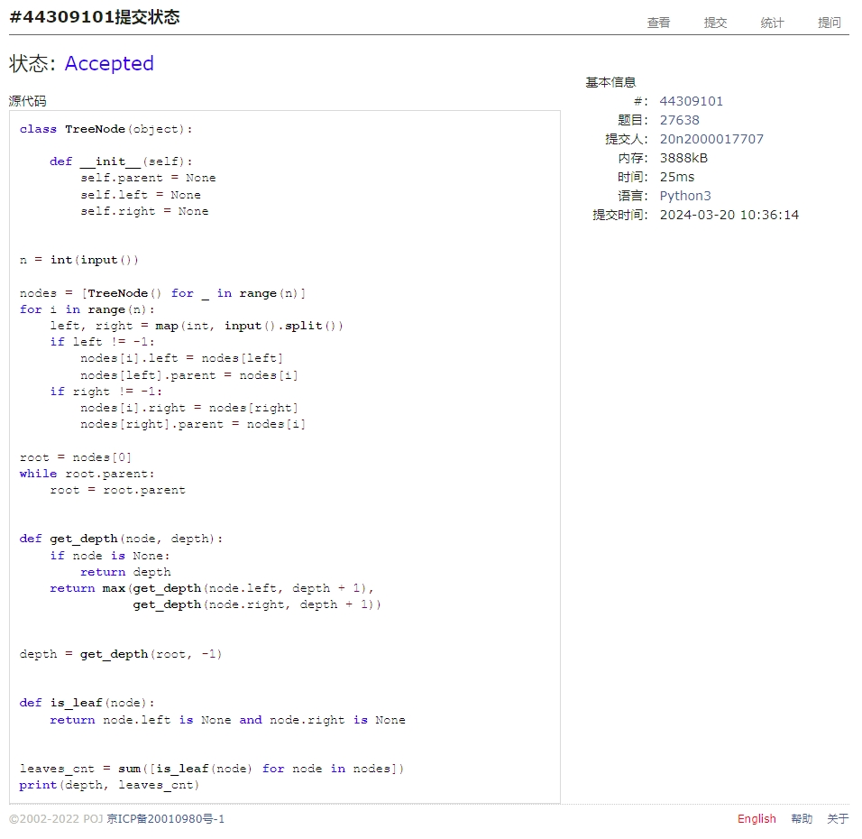

# Assignment #5: "树"算：概念、表示、解析、遍历

Updated 2124 GMT+8 March 17, 2024

2024 spring, Complied by Cat2Li

**说明：**

1）The complete process to learn DSA from scratch can be broken into 4 parts:

Learn about Time complexities, learn the basics of individual Data Structures, learn the basics of Algorithms, and practice Problems.

2）请把每个题目解题思路（可选），源码Python, 或者C++（已经在Codeforces/Openjudge上AC），截图（包含Accepted），填写到下面作业模版中（推荐使用 typora <https://typoraio.cn> ，或者用word）。AC 或者没有AC，都请标上每个题目大致花费时间。

3）提交时候先提交pdf文件，再把md或者doc文件上传到右侧“作业评论”。Canvas需要有同学清晰头像、提交文件有pdf、"作业评论"区有上传的md或者doc附件。

4）如果不能在截止前提交作业，请写明原因。

**编程环境**

==（请改为同学的操作系统、编程环境等）==

操作系统：Ubuntu 22.04.4 LTS

Python编程环境：VS Code 1.86.2; Python 3.12.2

C/C++编程环境：VS Code 1.86.2; gcc (Ubuntu 11.4.0-1ubuntu1~22.04) 11.4.0

## 1. 题目

### 27638: 求二叉树的高度和叶子数目

<http://cs101.openjudge.cn/practice/27638/>

思路：

代码

```python
class TreeNode(object):

    def __init__(self):
        self.parent = None
        self.left = None
        self.right = None


n = int(input())

nodes = [TreeNode() for _ in range(n)]
for i in range(n):
    left, right = map(int, input().split())
    if left != -1:
        nodes[i].left = nodes[left]
        nodes[left].parent = nodes[i]
    if right != -1:
        nodes[i].right = nodes[right]
        nodes[right].parent = nodes[i]

root = nodes[0]
while root.parent:
    root = root.parent


def get_depth(node, depth):
    if node is None:
        return depth
    return max(get_depth(node.left, depth + 1),
               get_depth(node.right, depth + 1))


depth = get_depth(root, -1)


def is_leaf(node):
    return node.left is None and node.right is None


leaves_cnt = sum([is_leaf(node) for node in nodes])
print(depth, leaves_cnt)
```

代码运行截图 ==（至少包含有"Accepted"）==


### 24729: 括号嵌套树

<http://cs101.openjudge.cn/practice/24729/>

思路：

代码

```python
from __future__ import annotations
from typing import List, Union


class TreeNode(object):

    def __init__(self, value):
        self.value: str = value
        self.nodes: List[TreeNode] = []

    def __str__(self):
        return self.value

    def insert_node(self, node: TreeNode):
        self.nodes.append(node)


def parse_input(str_tree: str) -> TreeNode:
    root = TreeNode(str_tree[0])

    stack = [root]
    for i in range(1, len(str_tree)):
        if str_tree[i] == '(':
            continue

        if str_tree[i] == ')' or str_tree[i] == ',':
            stack.pop()
            continue

        new_node = TreeNode(str_tree[i])
        stack[-1].insert_node(new_node)
        stack.append(new_node)

    return stack[0]


def preorder_traversal(root: TreeNode, res: List[str]) -> None:
    res.append(root.value)
    for node in root.nodes:
        preorder_traversal(node, res)
    return "".join(res)


def postorder_traversal(root: TreeNode, res: List[str]) -> None:
    for node in root.nodes:
        postorder_traversal(node, res)
    res.append(root.value)
    return "".join(res)


tree_str = input()
root = parse_input(tree_str)

preorder = preorder_traversal(root, [])
postorder = postorder_traversal(root, [])
print(preorder)
print(postorder)
```

代码运行截图 ==（至少包含有"Accepted"）==


### 02775: 文件结构“图”

<http://cs101.openjudge.cn/practice/02775/>

思路：

代码

```python
from __future__ import annotations
from typing import List


class TreeNode(object):

    def __init__(self, x):
        self.__name = x
        self.__children: List[TreeNode] = []
        self.__files: List[str] = []

    def add_child(self, child: TreeNode):
        self.__children.append(child)

    def add_file(self, file: str):
        self.__files.append(file)

    @property
    def name(self):
        return self.__name

    @property
    def children(self):
        return self.__children

    @property
    def files(self):
        return sorted(self.__files)


def build_tree() -> TreeNode:
    stack = [TreeNode("ROOT")]
    while True:
        identity = input()
        if identity == "#":
            exit(0)

        if identity == "*":
            break

        if identity == "]":
            assert len(stack) > 1
            stack.pop()

        if identity.startswith("f"):
            stack[-1].add_file(identity)

        if identity.startswith("d"):
            node = TreeNode(identity)
            stack[-1].add_child(node)
            stack.append(node)

    assert len(stack) == 1
    return stack[0]


def print_tree(node: TreeNode, depth: int) -> None:
    print("|     " * depth + node.name)
    for child in node.children:
        print_tree(child, depth + 1)
    for file in node.files:
        print("|     " * depth + file)


def task(i):
    root = build_tree()

    print(f"DATA SET {i}:")
    print_tree(root, 0)
    print()


i = 1
while True:
    task(i)
    i += 1
```

代码运行截图 ==（AC代码截图，至少包含有"Accepted"）==


### 25140: 根据后序表达式建立队列表达式

<http://cs101.openjudge.cn/practice/25140/>

思路：

代码

```python
from __future__ import annotations
from collections import deque
from typing import Union, Deque, List

OP_SET = set(chr(65 + i) for i in range(26))
NUM_SET = set(chr(97 + i) for i in range(26))


class TreeNode(object):

    def __init__(self, value: str, left: Union[TreeNode, str],
                 right: Union[TreeNode, str]):
        self.value = value
        self.left = left
        self.right = right


def build_tree() -> TreeNode:
    s = input()
    stack = []
    for char in s:
        if char in OP_SET:
            right = stack.pop()
            left = stack.pop()
            assert right is not str or right not in OP_SET
            assert left is not str or left not in OP_SET
            stack.append(TreeNode(char, left, right))
        elif char in NUM_SET:
            stack.append(char)
        else:
            raise ValueError

    assert len(stack) == 1
    return stack[0]


def bfs(root: TreeNode) -> str:
    q: Deque[Union[TreeNode, str]] = deque([root])

    res: List[str] = []
    while q:
        id = q.popleft()
        if isinstance(id, TreeNode):
            res.append(id.value)
            q.append(id.left)
            q.append(id.right)
        elif isinstance(id, str):
            res.append(id)
        else:
            raise ValueError

    return "".join(reversed(res))


def task():
    root = build_tree()
    output = bfs(root)
    print(output)


n = int(input())
for _ in range(n):
    task()

```

代码运行截图 ==（AC代码截图，至少包含有"Accepted"）==


### 24750: 根据二叉树中后序序列建树

<http://cs101.openjudge.cn/practice/24750/>

思路：

代码

```python
from __future__ import annotations
from typing import Union, List


class TreeNode(object):

    def __init__(self, value: str, left: Union[TreeNode, str, None],
                 right: Union[TreeNode, str, None]):
        self.value = value
        self.left = left
        self.right = right

    def set_left(self, left: Union[TreeNode, str]):
        self.left = left

    def set_right(self, right: Union[TreeNode, str]):
        self.right = right


def build_tree(mid_order: str, post_order: str) -> TreeNode:
    root = TreeNode(post_order[-1], None, None)
    root_index = mid_order.index(root.value)

    # calculate the length of left and right sub-tree
    left_length = root_index
    right_length = len(mid_order) - root_index - 1
    assert right_length >= 0

    # build left sub-tree
    if left_length == 0:
        pass
    elif left_length == 1:
        root.set_left(mid_order[0])
    else:
        left_node = build_tree(mid_order[:left_length],
                               post_order[:left_length])
        root.set_left(left_node)

    # build right sub-tree
    if right_length == 0:
        pass
    elif right_length == 1:
        root.set_right(mid_order[-1])
    else:
        right_node = build_tree(mid_order[-right_length:],
                                post_order[-right_length - 1:-1])
        root.set_right(right_node)

    return root


def pre_order_builder(root: TreeNode, aux: List):
    aux.append(root.value)

    if isinstance(root.left, TreeNode):
        pre_order_builder(root.left, aux)
    elif isinstance(root.left, str):
        aux.append(root.left)
    else:
        assert root.left is None

    if isinstance(root.right, TreeNode):
        pre_order_builder(root.right, aux)
    elif isinstance(root.right, str):
        aux.append(root.right)
    else:
        assert root.right is None


mid_order = input()
post_order = input()

root = build_tree(mid_order, post_order)

res = []
pre_order_builder(root, res)

print("".join(res))
```

代码运行截图 ==（AC代码截图，至少包含有"Accepted"）==


### 22158: 根据二叉树前中序序列建树

<http://cs101.openjudge.cn/practice/22158/>

思路：

代码

```python
from __future__ import annotations
from typing import Union, List
from sys import stdin


class TreeNode(object):

    def __init__(self, value: str, left: Union[TreeNode, str, None],
                 right: Union[TreeNode, str, None]):
        self.value = value
        self.left = left
        self.right = right

    def set_left(self, left: Union[TreeNode, str]):
        self.left = left

    def set_right(self, right: Union[TreeNode, str]):
        self.right = right


def build_tree(pre_order: str, mid_order: str) -> TreeNode:
    root = TreeNode(pre_order[0], None, None)
    root_index = mid_order.index(root.value)

    # calculate the length of left and right sub-tree
    left_length = root_index
    right_length = len(pre_order) - root_index - 1
    assert right_length >= 0

    # build left sub-tree
    if left_length == 0:
        pass
    elif left_length == 1:
        root.set_left(mid_order[0])
    else:
        left_node = build_tree(pre_order[1:left_length + 1],
                               mid_order[:left_length])
        root.set_left(left_node)

    # build right sub-tree
    if right_length == 0:
        pass
    elif right_length == 1:
        root.set_right(mid_order[-1])
    else:
        right_node = build_tree(pre_order[-right_length:],
                                mid_order[-right_length:])
        root.set_right(right_node)

    return root


def post_order_builder(root: TreeNode, aux: List):
    if isinstance(root.left, TreeNode):
        post_order_builder(root.left, aux)
    elif isinstance(root.left, str):
        aux.append(root.left)
    else:
        assert root.left is None

    if isinstance(root.right, TreeNode):
        post_order_builder(root.right, aux)
    elif isinstance(root.right, str):
        aux.append(root.right)
    else:
        assert root.right is None

    aux.append(root.value)


def task(pre_order: str, mid_order: str):
    root = build_tree(pre_order, mid_order)

    res: List[str] = []
    post_order_builder(root, res)

    print("".join(res))


lines = stdin.readlines()
assert len(lines) % 2 == 0
for i in range(0, len(lines), 2):
    pre_order = lines[i].strip()
    mid_order = lines[i + 1].strip()
    task(pre_order, mid_order)
```

代码运行截图 ==（AC代码截图，至少包含有"Accepted"）==


## 2. 学习总结和收获

==如果作业题目简单，有否额外练习题目，比如：OJ“2024spring每日选做”、CF、LeetCode、洛谷等网站题目。==

题目要花时间但是不是很难！这学期课比较多，先少花点时间w
