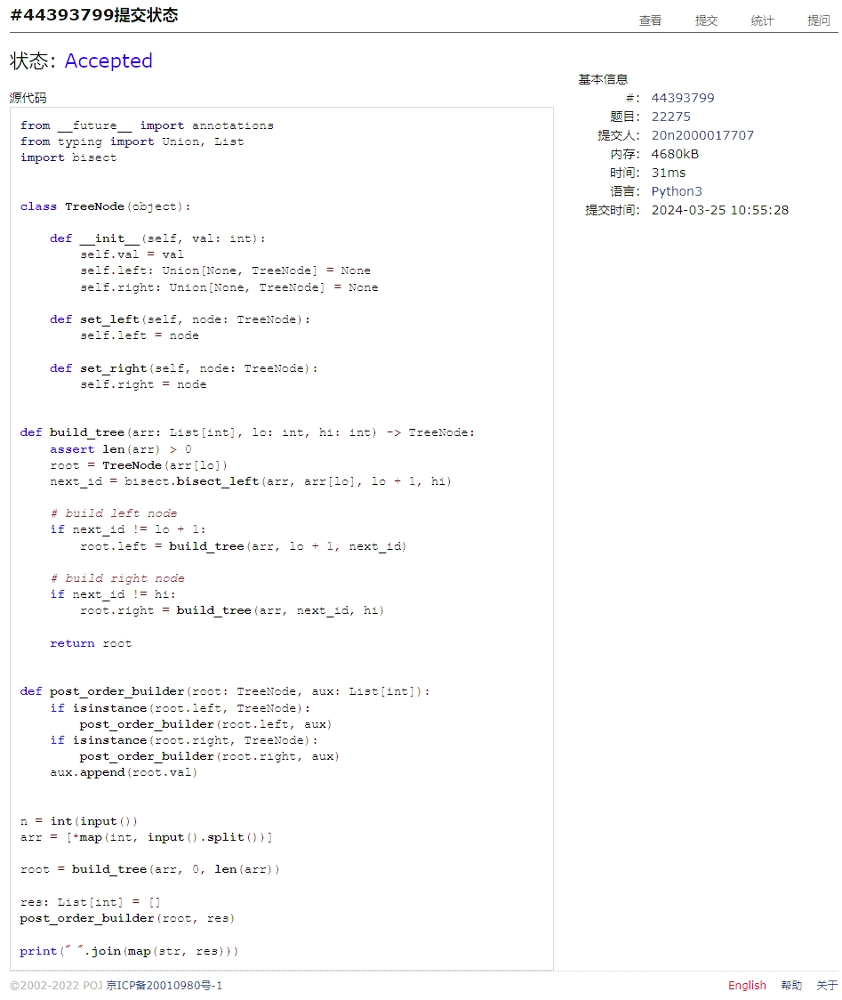
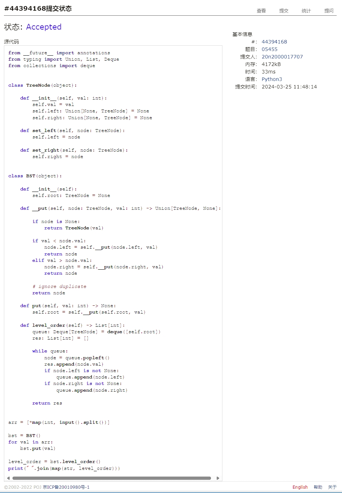
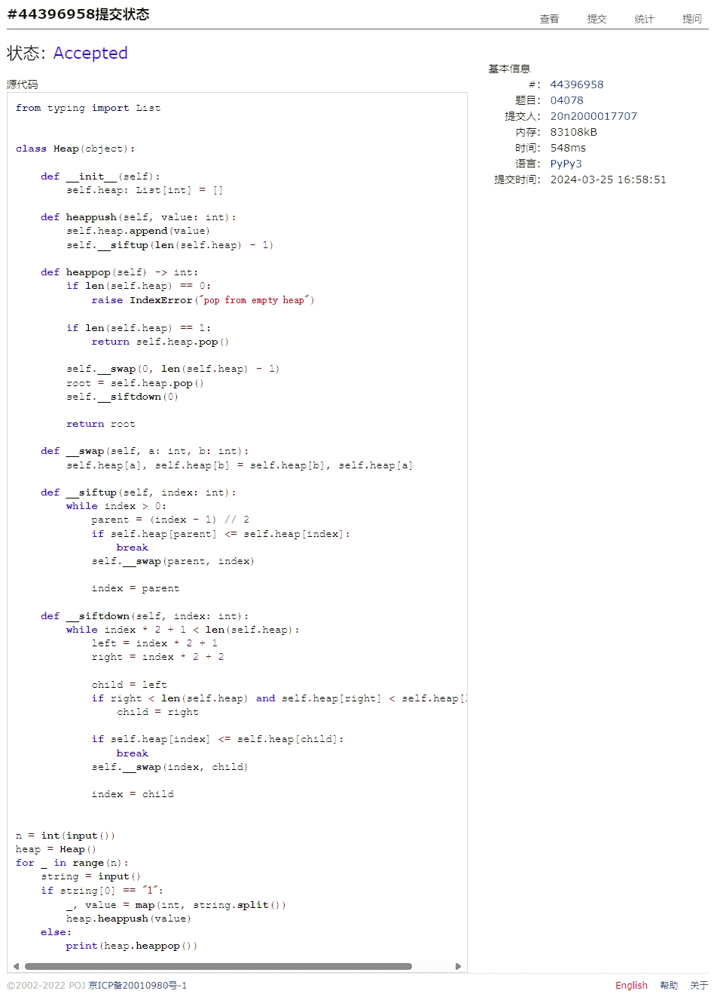
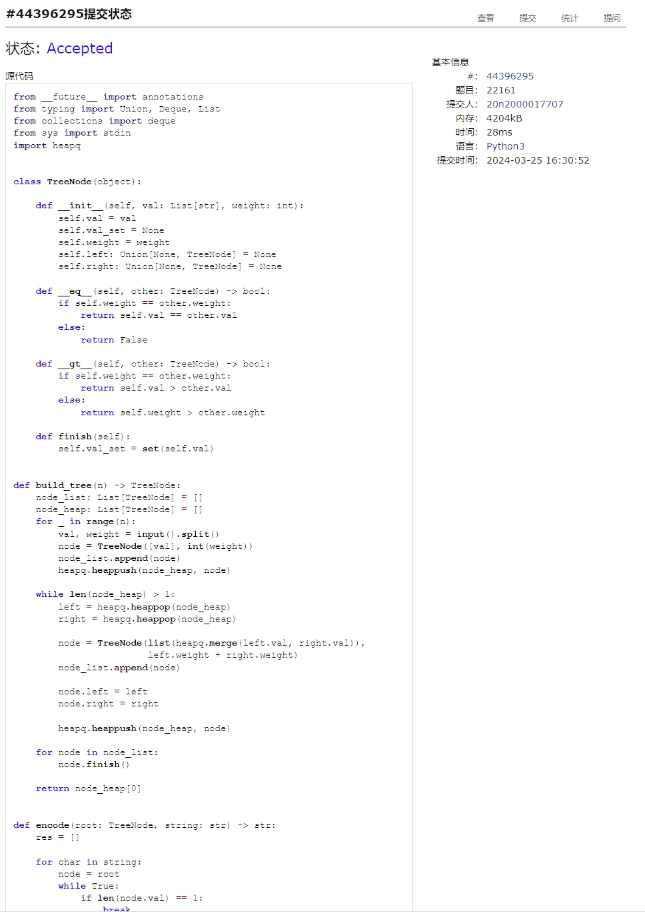
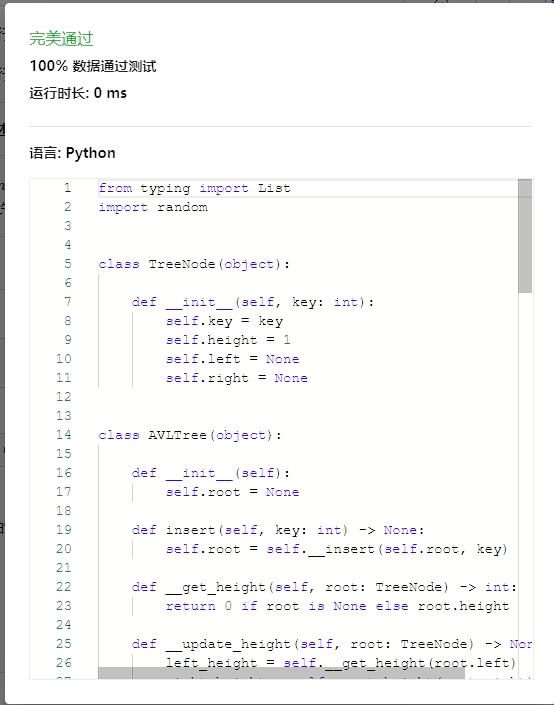
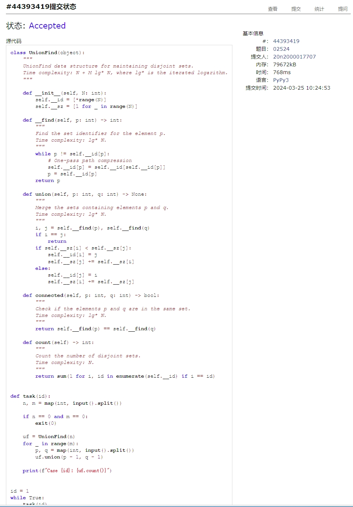

# Assignment #6: "树"算：Huffman,BinHeap,BST,AVL,DisjointSet

Updated 2214 GMT+8 March 24, 2024

2024 spring, Complied by Cat2Li

**说明：**

1）这次作业内容不简单，耗时长的话直接参考题解。

2）请把每个题目解题思路（可选），源码Python, 或者C++（已经在Codeforces/Openjudge上AC），截图（包含Accepted），填写到下面作业模版中（推荐使用 typora <https://typoraio.cn> ，或者用word）。AC 或者没有AC，都请标上每个题目大致花费时间。

3）提交时候先提交pdf文件，再把md或者doc文件上传到右侧“作业评论”。Canvas需要有同学清晰头像、提交文件有pdf、"作业评论"区有上传的md或者doc附件。

4）如果不能在截止前提交作业，请写明原因。

**编程环境**

==（请改为同学的操作系统、编程环境等）==

操作系统：Ubuntu 22.04.4 LTS

Python编程环境：VS Code 1.86.2; Python 3.12.2

C/C++编程环境：VS Code 1.86.2; gcc (Ubuntu 11.4.0-1ubuntu1~22.04) 11.4.0

## 1. 题目

### 22275: 二叉搜索树的遍历

<http://cs101.openjudge.cn/practice/22275/>

思路：

代码

```python
from __future__ import annotations
from typing import Union, List
import bisect


class TreeNode(object):

    def __init__(self, val: int):
        self.val = val
        self.left: Union[None, TreeNode] = None
        self.right: Union[None, TreeNode] = None

    def set_left(self, node: TreeNode):
        self.left = node

    def set_right(self, node: TreeNode):
        self.right = node


def build_tree(arr: List[int], lo: int, hi: int) -> TreeNode:
    assert len(arr) > 0
    root = TreeNode(arr[lo])
    next_id = bisect.bisect_left(arr, arr[lo], lo + 1, hi)

    # build left node
    if next_id != lo + 1:
        root.left = build_tree(arr, lo + 1, next_id)

    # build right node
    if next_id != hi:
        root.right = build_tree(arr, next_id, hi)

    return root


def post_order_builder(root: TreeNode, aux: List[int]):
    if isinstance(root.left, TreeNode):
        post_order_builder(root.left, aux)
    if isinstance(root.right, TreeNode):
        post_order_builder(root.right, aux)
    aux.append(root.val)


n = int(input())
arr = [*map(int, input().split())]

root = build_tree(arr, 0, len(arr))

res: List[int] = []
post_order_builder(root, res)

print(" ".join(map(str, res)))
```

代码运行截图 ==（至少包含有"Accepted"）==


### 05455: 二叉搜索树的层次遍历

<http://cs101.openjudge.cn/practice/05455/>

思路：

代码

```python
from __future__ import annotations
from typing import Union, List, Deque
from collections import deque


class TreeNode(object):

    def __init__(self, val: int):
        self.val = val
        self.left: Union[None, TreeNode] = None
        self.right: Union[None, TreeNode] = None


class BST(object):

    def __init__(self):
        self.root: TreeNode = None

    def __put(self, node: TreeNode, val: int) -> Union[TreeNode, None]:

        if node is None:
            return TreeNode(val)

        if val < node.val:
            node.left = self.__put(node.left, val)
            return node
        elif val > node.val:
            node.right = self.__put(node.right, val)
            return node
        else:
            # ignore duplicate
            pass

        return node

    def put(self, val: int) -> None:
        self.root = self.__put(self.root, val)

    def level_order(self) -> List[int]:
        queue: Deque[TreeNode] = deque([self.root])
        res: List[int] = []

        while queue:
            node = queue.popleft()
            res.append(node.val)
            if node.left is not None:
                queue.append(node.left)
            if node.right is not None:
                queue.append(node.right)

        return res


arr = [*map(int, input().split())]

bst = BST()
for val in arr:
    bst.put(val)

level_order = bst.level_order()
print(" ".join(map(str, level_order)))

```

代码运行截图 ==（至少包含有"Accepted"）==


### 04078: 实现堆结构

<http://cs101.openjudge.cn/practice/04078/>

练习自己写个BinHeap。当然机考时候，如果遇到这样题目，直接import heapq。手搓栈、队列、堆、AVL等，考试前需要搓个遍。

思路：

代码

```python
from typing import List


class Heap(object):

    def __init__(self):
        self.heap: List[int] = []

    def heappush(self, value: int):
        self.heap.append(value)
        self.__siftup(len(self.heap) - 1)

    def heappop(self) -> int:
        if len(self.heap) == 0:
            raise IndexError("pop from empty heap")

        if len(self.heap) == 1:
            return self.heap.pop()

        self.__swap(0, len(self.heap) - 1)
        root = self.heap.pop()
        self.__siftdown(0)

        return root

    def __swap(self, a: int, b: int):
        self.heap[a], self.heap[b] = self.heap[b], self.heap[a]

    def __siftup(self, index: int):
        while index > 0:
            parent = (index - 1) // 2
            if self.heap[parent] <= self.heap[index]:
                break
            self.__swap(parent, index)

            index = parent

    def __siftdown(self, index: int):
        while index * 2 + 1 < len(self.heap):
            left = index * 2 + 1
            right = index * 2 + 2

            child = left
            if right < len(self.heap) and self.heap[right] < self.heap[left]:
                child = right

            if self.heap[index] <= self.heap[child]:
                break
            self.__swap(index, child)

            index = child


n = int(input())
heap = Heap()
for _ in range(n):
    string = input()
    if string[0] == "1":
        _, value = map(int, string.split())
        heap.heappush(value)
    else:
        print(heap.heappop())
```

代码运行截图 ==（AC代码截图，至少包含有"Accepted"）==


### 22161: 哈夫曼编码树

<http://cs101.openjudge.cn/practice/22161/>

思路：

代码

```python
from __future__ import annotations
from typing import Union, Deque, List
from collections import deque
from sys import stdin
import heapq


class TreeNode(object):

    def __init__(self, val: List[str], weight: int):
        self.val = val
        self.val_set = None
        self.weight = weight
        self.left: Union[None, TreeNode] = None
        self.right: Union[None, TreeNode] = None

    def __eq__(self, other: TreeNode) -> bool:
        if self.weight == other.weight:
            return self.val == other.val
        else:
            return False

    def __gt__(self, other: TreeNode) -> bool:
        if self.weight == other.weight:
            return self.val > other.val
        else:
            return self.weight > other.weight

    def finish(self):
        self.val_set = set(self.val)


def build_tree(n) -> TreeNode:
    node_list: List[TreeNode] = []
    node_heap: List[TreeNode] = []
    for _ in range(n):
        val, weight = input().split()
        node = TreeNode([val], int(weight))
        node_list.append(node)
        heapq.heappush(node_heap, node)

    while len(node_heap) > 1:
        left = heapq.heappop(node_heap)
        right = heapq.heappop(node_heap)

        node = TreeNode(list(heapq.merge(left.val, right.val)),
                        left.weight + right.weight)
        node_list.append(node)

        node.left = left
        node.right = right

        heapq.heappush(node_heap, node)

    for node in node_list:
        node.finish()

    return node_heap[0]


def encode(root: TreeNode, string: str) -> str:
    res = []

    for char in string:
        node = root
        while True:
            if len(node.val) == 1:
                break

            if char in node.left.val_set:
                node = node.left
                res.append('0')
            else:
                node = node.right
                res.append('1')

    return ''.join(res)


def decode(root: TreeNode, string: str) -> str:
    res = []

    i = 0
    while i < len(string):
        node = root
        while True:
            # if node is leaf
            if len(node.val) == 1:
                break

            # if node is not leaf
            if string[i] == '0':
                node = node.left
            else:
                node = node.right
            i += 1
        res.append(node.val[0])

    return ''.join(res)


n = int(input())
root = build_tree(n)
for line in stdin.readlines():
    line = line.strip()
    if line[0] in root.val_set:
        print(encode(root, line))
    else:
        print(decode(root, line))

```

代码运行截图 ==（AC代码截图，至少包含有"Accepted"）==


### 晴问9.5: 平衡二叉树的建立

<https://sunnywhy.com/sfbj/9/5/359>

思路：

代码

```python
from typing import List


class TreeNode(object):

    def __init__(self, key: int):
        self.key = key
        self.height = 1
        self.left = None
        self.right = None


class AVLTree(object):

    def __init__(self):
        self.root = None

    def insert(self, key: int) -> None:
        self.root = self.__insert(self.root, key)

    def __get_height(self, root: TreeNode) -> int:
        return 0 if root is None else root.height

    def __update_height(self, root: TreeNode) -> None:
        left_height = self.__get_height(root.left)
        right_height = self.__get_height(root.right)
        root.height = max(left_height, right_height) + 1

    def __get_balance_factor(self, root: TreeNode) -> int:
        left_height = self.__get_height(root.left)
        right_height = self.__get_height(root.right)
        return left_height - right_height

    def __right_rotate(self, root: TreeNode) -> TreeNode:
        left = root.left
        root.left = left.right
        left.right = root

        self.__update_height(root)
        self.__update_height(left)

        return left

    def __left_rotate(self, root: TreeNode) -> TreeNode:
        right = root.right
        root.right = right.left
        right.left = root

        self.__update_height(root)
        self.__update_height(right)

        return right

    def __insert(self, root: TreeNode, key: int) -> TreeNode:
        if root is None:
            return TreeNode(key)

        if key < root.key:
            root.left = self.__insert(root.left, key)
        elif key > root.key:
            root.right = self.__insert(root.right, key)
        else:
            # ignore duplicate
            return root

        self.__update_height(root)

        balance_factor = self.__get_balance_factor(root)

        if balance_factor > 1:
            if key < root.left.key:
                # left-left case
                root = self.__right_rotate(root)
            else:
                # left-right case
                root.left = self.__left_rotate(root.left)
                root = self.__right_rotate(root)
        elif balance_factor < -1:
            if key > root.right.key:
                # right-right case
                root = self.__left_rotate(root)
            else:
                # right-left case
                root.right = self.__right_rotate(root.right)
                root = self.__left_rotate(root)

        return root

    def insert(self, key: int) -> None:
        self.root = self.__insert(self.root, key)

    def __pre_order(self, root: TreeNode, res: List[int]):
        if root is None:
            return
        res.append(root.key)
        self.__pre_order(root.left, res)
        self.__pre_order(root.right, res)

    def pre_order(self):
        res: List[int] = []
        self.__pre_order(self.root, res)
        return " ".join(map(str, res))


n = int(input())
arr = [*map(int, input().split())]

avl_tree = AVLTree()
for val in arr:
    avl_tree.insert(val)

print(avl_tree.pre_order())
```

代码运行截图 ==（AC代码截图，至少包含有"Accepted"）==


### 02524: 宗教信仰

<http://cs101.openjudge.cn/practice/02524/>

思路：

代码

```python
class UnionFind(object):
    """
    UnionFind data structure for maintaining disjoint sets.
    Time complexity: N + M lg* N, where lg* is the iterated logarithm.
    """

    def __init__(self, N: int):
        self.__id = [*range(N)]
        self.__sz = [1 for _ in range(N)]

    def __find(self, p: int) -> int:
        """
        Find the set identifier for the element p.
        Time complexity: lg* N.
        """
        while p != self.__id[p]:
            # One-pass path compression
            self.__id[p] = self.__id[self.__id[p]]
            p = self.__id[p]
        return p

    def union(self, p: int, q: int) -> None:
        """
        Merge the sets containing elements p and q.
        Time complexity: lg* N.
        """
        i, j = self.__find(p), self.__find(q)
        if i == j:
            return
        if self.__sz[i] < self.__sz[j]:
            self.__id[i] = j
            self.__sz[j] += self.__sz[i]
        else:
            self.__id[j] = i
            self.__sz[i] += self.__sz[j]

    def connected(self, p: int, q: int) -> bool:
        """
        Check if the elements p and q are in the same set.
        Time complexity: lg* N.
        """
        return self.__find(p) == self.__find(q)

    def count(self) -> int:
        """
        Count the number of disjoint sets.
        Time complexity: N.
        """
        return sum(1 for i, id in enumerate(self.__id) if i == id)


def task(id):
    n, m = map(int, input().split())

    if n == 0 and m == 0:
        exit(0)

    uf = UnionFind(n)
    for _ in range(m):
        p, q = map(int, input().split())
        uf.union(p - 1, q - 1)

    print(f"Case {id}: {uf.count()}")


id = 1
while True:
    task(id)
    id += 1
```

代码运行截图 ==（AC代码截图，至少包含有"Accepted"）==


## 2. 学习总结和收获

==如果作业题目简单，有否额外练习题目，比如：OJ“2024spring每日选做”、CF、LeetCode、洛谷等网站题目。==
有点难！花了不少时间，但是收获很大！
