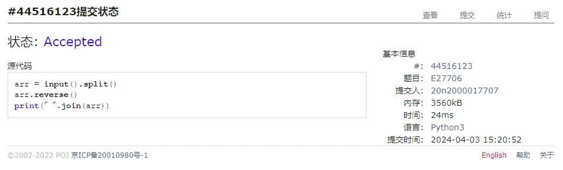
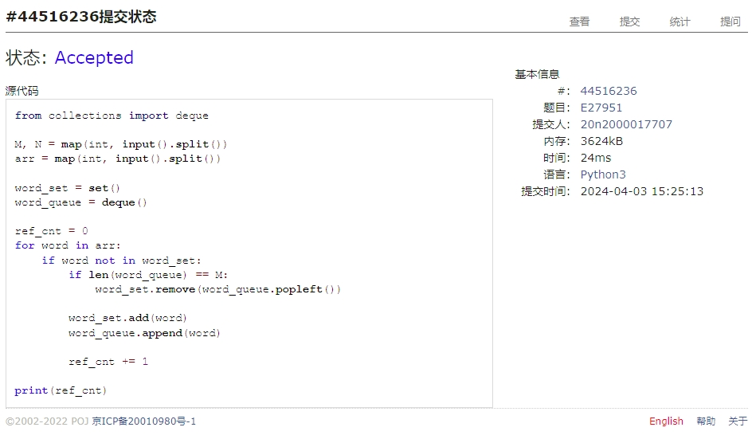
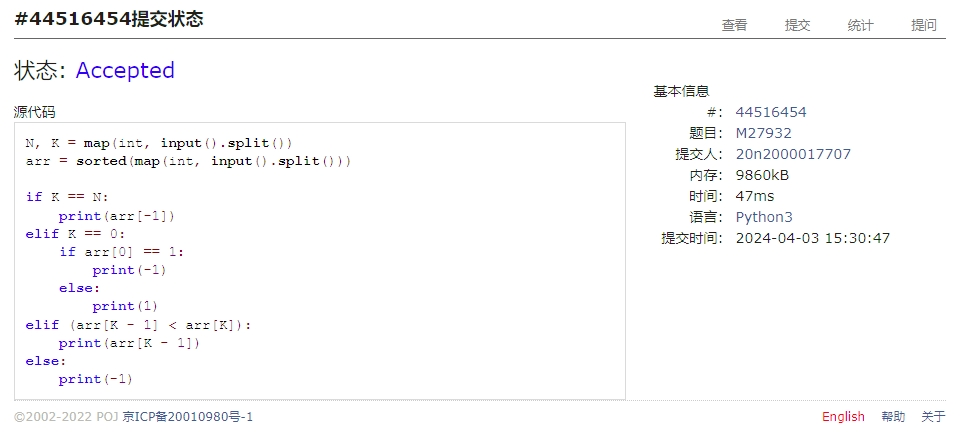
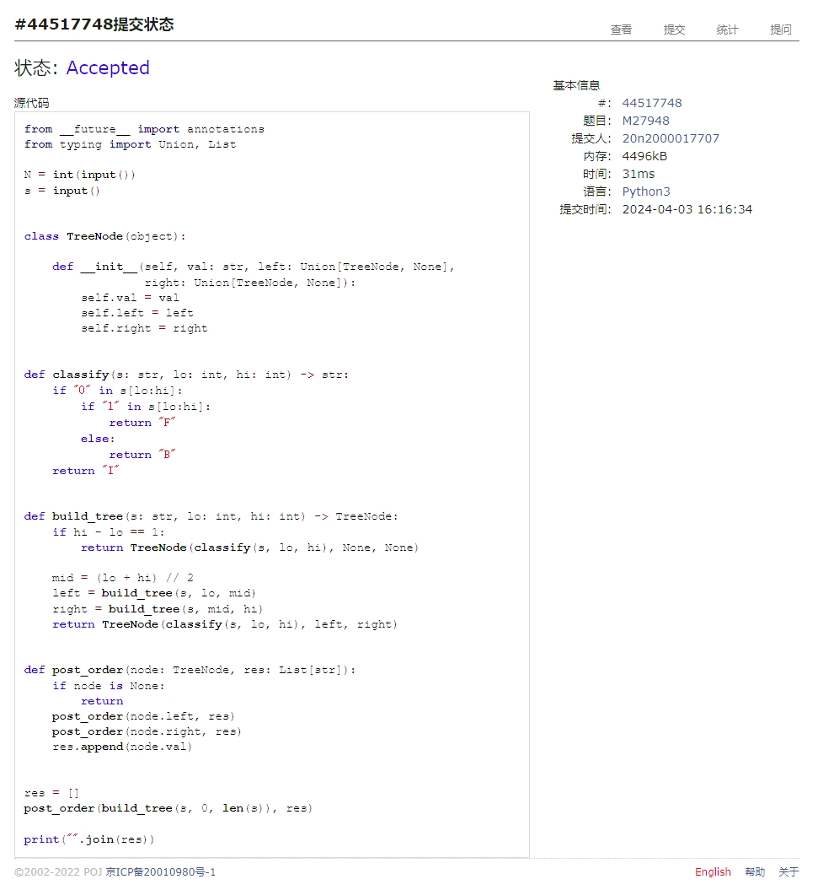
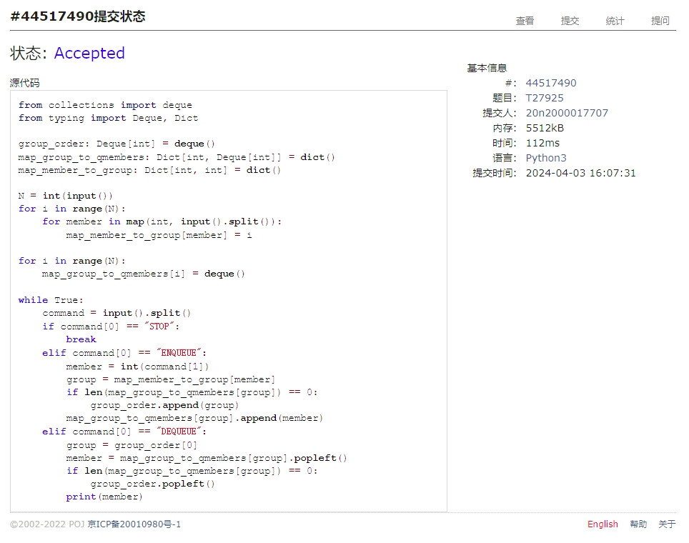
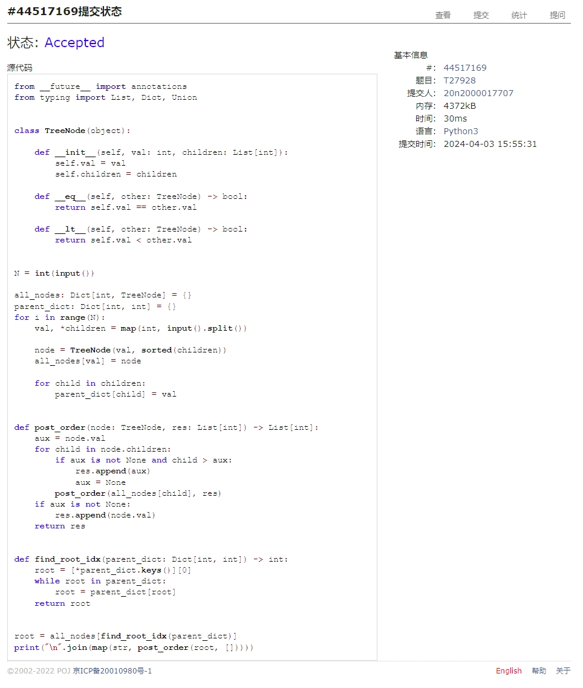

# Assignment #7: April 月考

Updated 1557 GMT+8 Apr 3, 2024

2024 spring, Complied by Cat2Li

**说明：**

1）请把每个题目解题思路（可选），源码Python, 或者C++（已经在Codeforces/Openjudge上AC），截图（包含Accepted），填写到下面作业模版中（推荐使用 typora <https://typoraio.cn> ，或者用word）。AC 或者没有AC，都请标上每个题目大致花费时间。

2）提交时候先提交pdf文件，再把md或者doc文件上传到右侧“作业评论”。Canvas需要有同学清晰头像、提交文件有pdf、"作业评论"区有上传的md或者doc附件。

3）如果不能在截止前提交作业，请写明原因。

**编程环境**

==（请改为同学的操作系统、编程环境等）==

操作系统：Ubuntu 22.04.4 LTS

Python编程环境：VS Code 1.86.2; Python 3.12.2

C/C++编程环境：VS Code 1.86.2; gcc (Ubuntu 11.4.0-1ubuntu1~22.04) 11.4.0

## 1. 题目

### 27706: 逐词倒放

<http://cs101.openjudge.cn/practice/27706/>

思路：

代码

```python
arr = input().split()
arr.reverse()
print(" ".join(arr))
```

代码运行截图 ==（至少包含有"Accepted"）==


### 27951: 机器翻译

<http://cs101.openjudge.cn/practice/27951/>

思路：

代码

```python
from collections import deque

M, N = map(int, input().split())
arr = map(int, input().split())

word_set = set()
word_queue = deque()

ref_cnt = 0
for word in arr:
    if word not in word_set:
        if len(word_queue) == M:
            word_set.remove(word_queue.popleft())

        word_set.add(word)
        word_queue.append(word)

        ref_cnt += 1

print(ref_cnt)
```

代码运行截图 ==（至少包含有"Accepted"）==


### 27932: Less or Equal

<http://cs101.openjudge.cn/practice/27932/>

思路：

代码

```python
N, K = map(int, input().split())
arr = sorted(map(int, input().split()))

if K == N:
    print(arr[-1])
elif K == 0:
    if arr[0] == 1:
        print(-1)
    else:
        print(1)
elif (arr[K - 1] < arr[K]):
    print(arr[K - 1])
else:
    print(-1)
```

代码运行截图 ==（AC代码截图，至少包含有"Accepted"）==


### 27948: FBI树

<http://cs101.openjudge.cn/practice/27948/>

思路：

代码

```python
from __future__ import annotations
from typing import Union, List

N = int(input())
s = input()


class TreeNode(object):

    def __init__(self, val: str, left: Union[TreeNode, None],
                 right: Union[TreeNode, None]):
        self.val = val
        self.left = left
        self.right = right


def classify(s: str, lo: int, hi: int) -> str:
    if "0" in s[lo:hi]:
        if "1" in s[lo:hi]:
            return "F"
        else:
            return "B"
    return "I"


def build_tree(s: str, lo: int, hi: int) -> TreeNode:
    if hi - lo == 1:
        return TreeNode(classify(s, lo, hi), None, None)

    mid = (lo + hi) // 2
    left = build_tree(s, lo, mid)
    right = build_tree(s, mid, hi)
    return TreeNode(classify(s, lo, hi), left, right)


def post_order(node: TreeNode, res: List[str]):
    if node is None:
        return
    post_order(node.left, res)
    post_order(node.right, res)
    res.append(node.val)


res = []
post_order(build_tree(s, 0, len(s)), res)

print("".join(res))
```

代码运行截图 ==（AC代码截图，至少包含有"Accepted"）==


### 27925: 小组队列

<http://cs101.openjudge.cn/practice/27925/>

思路：

代码

```python
from collections import deque
from typing import Deque, Dict

group_order: Deque[int] = deque()
map_group_to_qmembers: Dict[int, Deque[int]] = dict()
map_member_to_group: Dict[int, int] = dict()

N = int(input())
for i in range(N):
    for member in map(int, input().split()):
        map_member_to_group[member] = i

for i in range(N):
    map_group_to_qmembers[i] = deque()

while True:
    command = input().split()
    if command[0] == "STOP":
        break
    elif command[0] == "ENQUEUE":
        member = int(command[1])
        group = map_member_to_group[member]
        if len(map_group_to_qmembers[group]) == 0:
            group_order.append(group)
        map_group_to_qmembers[group].append(member)
    elif command[0] == "DEQUEUE":
        group = group_order[0]
        member = map_group_to_qmembers[group].popleft()
        if len(map_group_to_qmembers[group]) == 0:
            group_order.popleft()
        print(member)
```

代码运行截图 ==（AC代码截图，至少包含有"Accepted"）==


### 27928: 遍历树

<http://cs101.openjudge.cn/practice/27928/>

思路：

代码

```python
from __future__ import annotations
from typing import List, Dict, Union


class TreeNode(object):

    def __init__(self, val: int, children: List[int]):
        self.val = val
        self.children = children

    def __eq__(self, other: TreeNode) -> bool:
        return self.val == other.val

    def __lt__(self, other: TreeNode) -> bool:
        return self.val < other.val


N = int(input())

all_nodes: Dict[int, TreeNode] = {}
parent_dict: Dict[int, int] = {}
for i in range(N):
    val, *children = map(int, input().split())

    node = TreeNode(val, sorted(children))
    all_nodes[val] = node

    for child in children:
        parent_dict[child] = val


def post_order(node: TreeNode, res: List[int]) -> List[int]:
    aux = node.val
    for child in node.children:
        if aux is not None and child > aux:
            res.append(aux)
            aux = None
        post_order(all_nodes[child], res)
    if aux is not None:
        res.append(node.val)
    return res


def find_root_idx(parent_dict: Dict[int, int]) -> int:
    root = [*parent_dict.keys()][0]
    while root in parent_dict:
        root = parent_dict[root]
    return root


root = all_nodes[find_root_idx(parent_dict)]
print("\n".join(map(str, post_order(root, []))))
```

代码运行截图 ==（AC代码截图，至少包含有"Accepted"）==


## 2. 学习总结和收获

==如果作业题目简单，有否额外练习题目，比如：OJ“2024spring每日选做”、CF、LeetCode、洛谷等网站题目。==
感觉是平时作业的拓展，对答题模板稍加变动即可得到代码！
