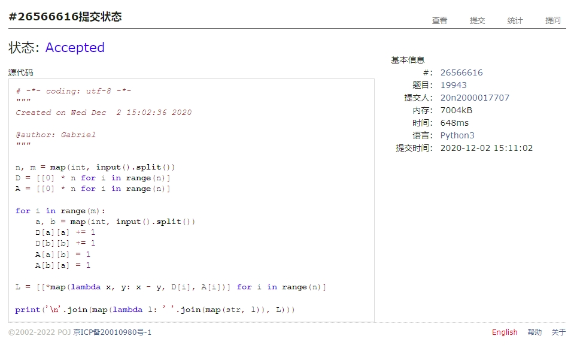
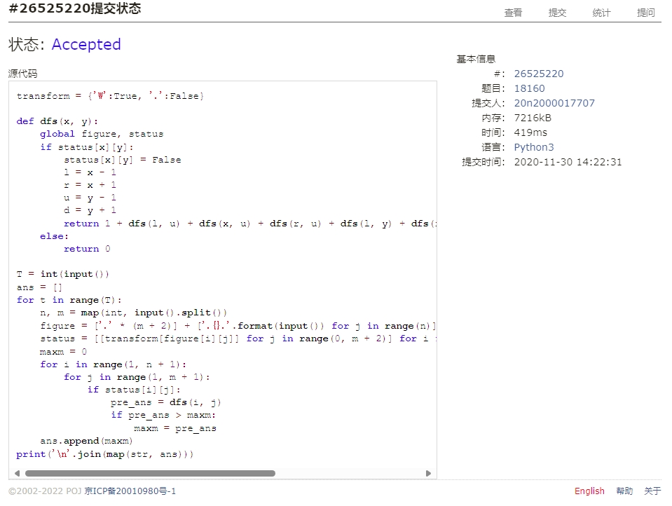
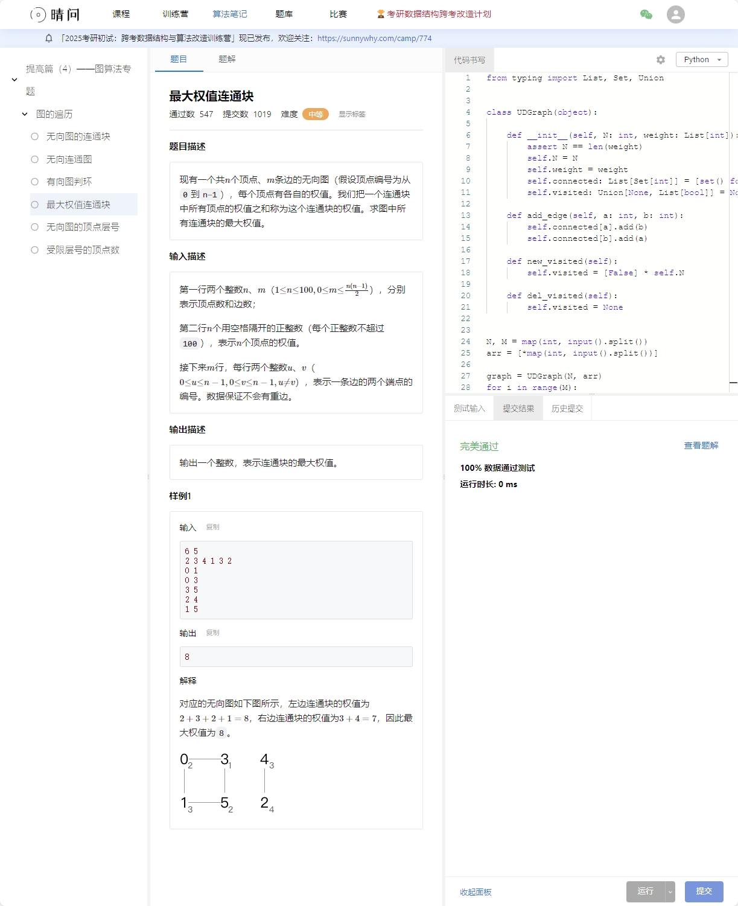
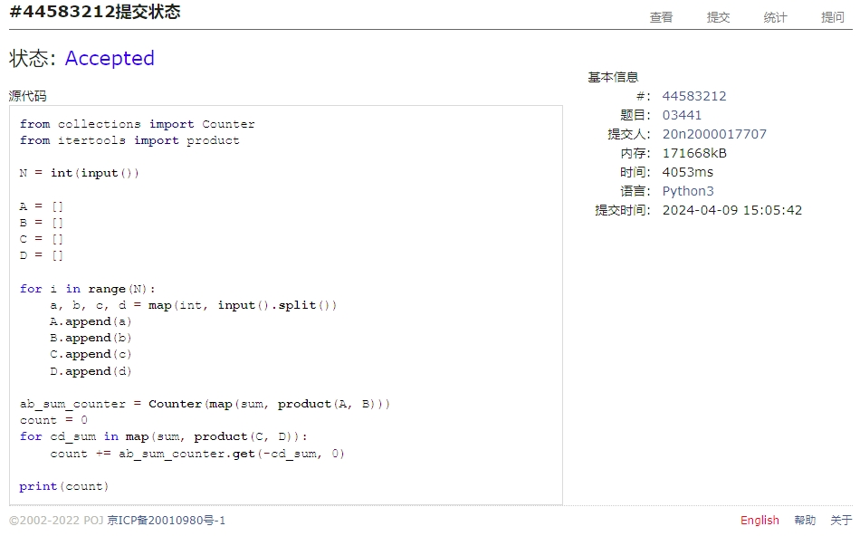
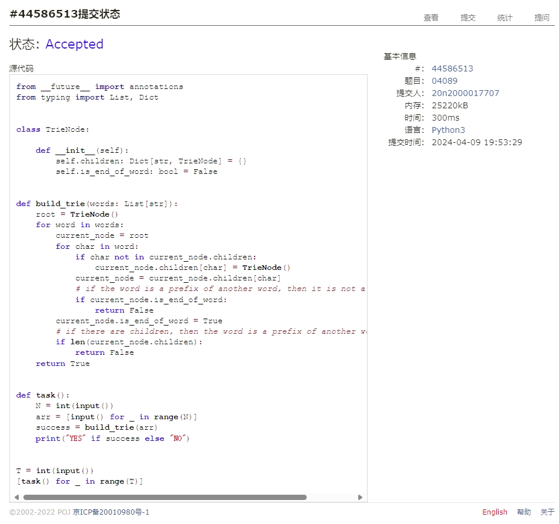
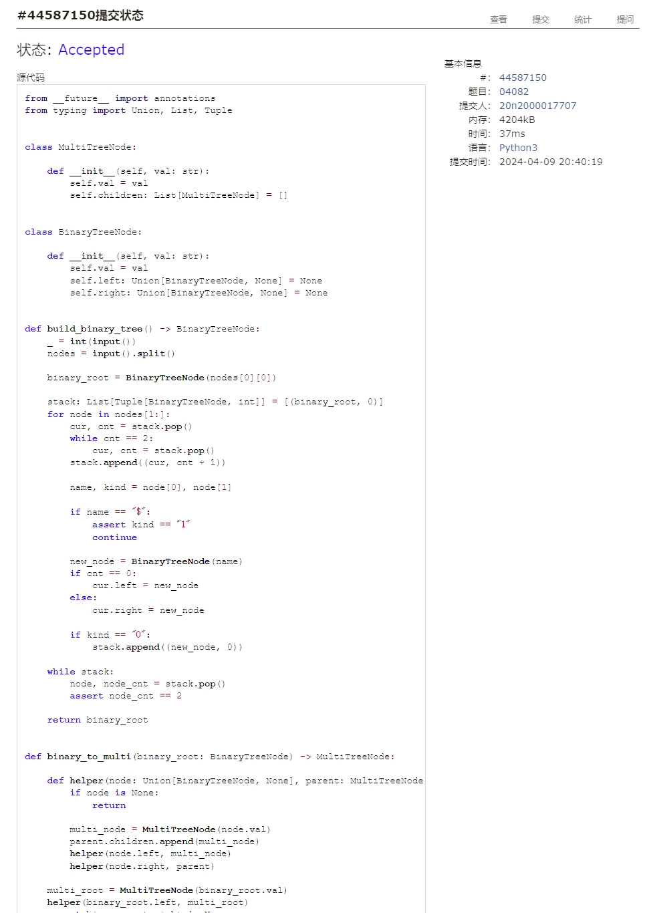

# Assignment #8: 图论：概念、遍历，及 树算

Updated 1919 GMT+8 Apr 8, 2024

2024 spring, Complied by Cat2Li

**说明：**

1）请把每个题目解题思路（可选），源码Python, 或者C++（已经在Codeforces/Openjudge上AC），截图（包含Accepted），填写到下面作业模版中（推荐使用 typora <https://typoraio.cn> ，或者用word）。AC 或者没有AC，都请标上每个题目大致花费时间。

2）提交时候先提交pdf文件，再把md或者doc文件上传到右侧“作业评论”。Canvas需要有同学清晰头像、提交文件有pdf、"作业评论"区有上传的md或者doc附件。

3）如果不能在截止前提交作业，请写明原因。

**编程环境**

==（请改为同学的操作系统、编程环境等）==

操作系统：Ubuntu 22.04.4 LTS

Python编程环境：VS Code 1.86.2; Python 3.12.2

C/C++编程环境：VS Code 1.86.2; gcc (Ubuntu 11.4.0-1ubuntu1~22.04) 11.4.0

## 1. 题目

### 19943: 图的拉普拉斯矩阵

matrices, <http://cs101.openjudge.cn/practice/19943/>

请定义Vertex类，Graph类，然后实现

思路：

代码

```python
n, m = map(int, input().split())
D = [[0] * n for i in range(n)]
A = [[0] * n for i in range(n)]

for i in range(m):
    a, b = map(int, input().split())
    D[a][a] += 1
    D[b][b] += 1
    A[a][b] = 1
    A[b][a] = 1

L = [[*map(lambda x, y: x - y, D[i], A[i])] for i in range(n)]

print('\n'.join(map(lambda l: ' '.join(map(str, l)), L)))
```

代码运行截图 ==（至少包含有"Accepted"）==


### 18160: 最大连通域面积

matrix/dfs similar, <http://cs101.openjudge.cn/practice/18160>

思路：

代码

```python
transform = {'W':True, '.':False}

def dfs(x, y):
    global figure, status
    if status[x][y]:
        status[x][y] = False
        l = x - 1
        r = x + 1
        u = y - 1
        d = y + 1
        return 1 + dfs(l, u) + dfs(x, u) + dfs(r, u) + dfs(l, y) + dfs(r, y) + dfs(l, d) + dfs(x, d) + dfs(r, d)
    else:
        return 0

T = int(input())
ans = []
for t in range(T):
    n, m = map(int, input().split())
    figure = ['.' * (m + 2)] + ['.{}.'.format(input()) for j in range(n)] + ['.' * (m + 2)] 
    status = [[transform[figure[i][j]] for j in range(0, m + 2)] for i in range(0, n + 2)]
    maxm = 0
    for i in range(1, n + 1):
        for j in range(1, m + 1):
            if status[i][j]:
                pre_ans = dfs(i, j)
                if pre_ans > maxm:
                    maxm = pre_ans
    ans.append(maxm)
print('\n'.join(map(str, ans)))
```

代码运行截图 ==（至少包含有"Accepted"）==


### sy383: 最大权值连通块

<https://sunnywhy.com/sfbj/10/3/383>

思路：带标记的 DFS，和 18160 思路基本相同

代码

```python
from typing import List, Set, Union


class UDGraph(object):

    def __init__(self, N: int, weight: List[int]):
        assert N == len(weight)
        self.N = N
        self.weight = weight
        self.connected: List[Set[int]] = [set() for i in range(N)]
        self.visited: Union[None, List[bool]] = None

    def add_edge(self, a: int, b: int):
        self.connected[a].add(b)
        self.connected[b].add(a)

    def new_visited(self):
        self.visited = [False] * self.N

    def del_visited(self):
        self.visited = None


N, M = map(int, input().split())
arr = [*map(int, input().split())]

graph = UDGraph(N, arr)
for i in range(M):
    a, b = map(int, input().split())
    graph.add_edge(a, b)

graph.new_visited()
res = []
for i in range(N):
    stack: List[int] = []
    stack.append(i)
    value = 0
    while stack:
        v = stack.pop()
        if graph.visited[v]:
            continue
        value += graph.weight[v]
        graph.visited[v] = True
        for u in graph.connected[v]:
            if not graph.visited[u]:
                stack.append(u)
    res.append(value)

graph.del_visited()
print(max(res))
```



代码运行截图 ==（AC代码截图，至少包含有"Accepted"）==

### 03441: 4 Values whose Sum is 0

data structure/binary search, <http://cs101.openjudge.cn/practice/03441>

思路：

代码

```python
from collections import Counter
from itertools import product

N = int(input())

A = []
B = []
C = []
D = []

for i in range(N):
    a, b, c, d = map(int, input().split())
    A.append(a)
    B.append(b)
    C.append(c)
    D.append(d)

ab_sum_counter = Counter(map(sum, product(A, B)))
count = 0
for cd_sum in map(sum, product(C, D)):
    count += ab_sum_counter.get(-cd_sum, 0)

print(count)
```

代码运行截图 ==（AC代码截图，至少包含有"Accepted"）==


### 04089: 电话号码

trie, <http://cs101.openjudge.cn/practice/04089/>

Trie 数据结构可能需要自学下。

思路：

代码

```python
from __future__ import annotations
from typing import List, Dict


class TrieNode:

    def __init__(self):
        self.children: Dict[str, TrieNode] = {}
        self.is_end_of_word: bool = False


def build_trie(words: List[str]):
    root = TrieNode()
    for word in words:
        current_node = root
        for char in word:
            if char not in current_node.children:
                current_node.children[char] = TrieNode()
            current_node = current_node.children[char]
            # if the word is a prefix of another word, then it is not a valid word
            if current_node.is_end_of_word:
                return False
        current_node.is_end_of_word = True
        # if there are children, then the word is a prefix of another word
        if len(current_node.children):
            return False
    return True


def task():
    N = int(input())
    arr = [input() for _ in range(N)]
    success = build_trie(arr)
    print("YES" if success else "NO")


T = int(input())
[task() for _ in range(T)]
```

代码运行截图 ==（AC代码截图，至少包含有"Accepted"）==


### 04082: 树的镜面映射

<http://cs101.openjudge.cn/practice/04082/>

思路：
我的思路比较抓马，建立二叉树-转换为多叉树-reverse-然后层次遍历
看了下题解发现可以直接建立多叉树，就当是练习了

代码

```python
from __future__ import annotations
from typing import Union, List, Tuple


class MultiTreeNode:

    def __init__(self, val: str):
        self.val = val
        self.children: List[MultiTreeNode] = []


class BinaryTreeNode:

    def __init__(self, val: str):
        self.val = val
        self.left: Union[BinaryTreeNode, None] = None
        self.right: Union[BinaryTreeNode, None] = None


def build_binary_tree() -> BinaryTreeNode:
    _ = int(input())
    nodes = input().split()

    binary_root = BinaryTreeNode(nodes[0][0])

    stack: List[Tuple[BinaryTreeNode, int]] = [(binary_root, 0)]
    for node in nodes[1:]:
        cur, cnt = stack.pop()
        while cnt == 2:
            cur, cnt = stack.pop()
        stack.append((cur, cnt + 1))

        name, kind = node[0], node[1]

        if name == "$":
            assert kind == "1"
            continue

        new_node = BinaryTreeNode(name)
        if cnt == 0:
            cur.left = new_node
        else:
            cur.right = new_node

        if kind == "0":
            stack.append((new_node, 0))

    while stack:
        node, node_cnt = stack.pop()
        assert node_cnt == 2

    return binary_root


def binary_to_multi(binary_root: BinaryTreeNode) -> MultiTreeNode:

    def helper(node: Union[BinaryTreeNode, None], parent: MultiTreeNode):
        if node is None:
            return

        multi_node = MultiTreeNode(node.val)
        parent.children.append(multi_node)
        helper(node.left, multi_node)
        helper(node.right, parent)

    multi_root = MultiTreeNode(binary_root.val)
    helper(binary_root.left, multi_root)
    assert binary_root.right is None

    return multi_root


def reverse(multi_node: MultiTreeNode):
    if multi_node is None:
        return

    multi_node.children.reverse()
    for child in multi_node.children:
        reverse(child)


def layer_order_traversal(multi_node: MultiTreeNode):

    def helper(multi_node: MultiTreeNode, res: List[str]):
        if multi_node is None:
            return

        queue = [multi_node]
        while queue:
            node = queue.pop(0)
            res.append(node.val)
            queue.extend(node.children)

    res = []
    helper(multi_node, res)
    return " ".join(res)


binary_root = build_binary_tree()
multi_root = binary_to_multi(binary_root)
reverse(multi_root)
print(layer_order_traversal(multi_root))
```

代码运行截图 ==（AC代码截图，至少包含有"Accepted"）==


## 2. 学习总结和收获

==如果作业题目简单，有否额外练习题目，比如：OJ“2024spring每日选做”、CF、LeetCode、洛谷等网站题目。==
前两道题自己三年前学计概时候的写过，就直接粘贴过来了；
相比于那时，写复杂代码的能力和代码风格都进步很大，继续加油！
