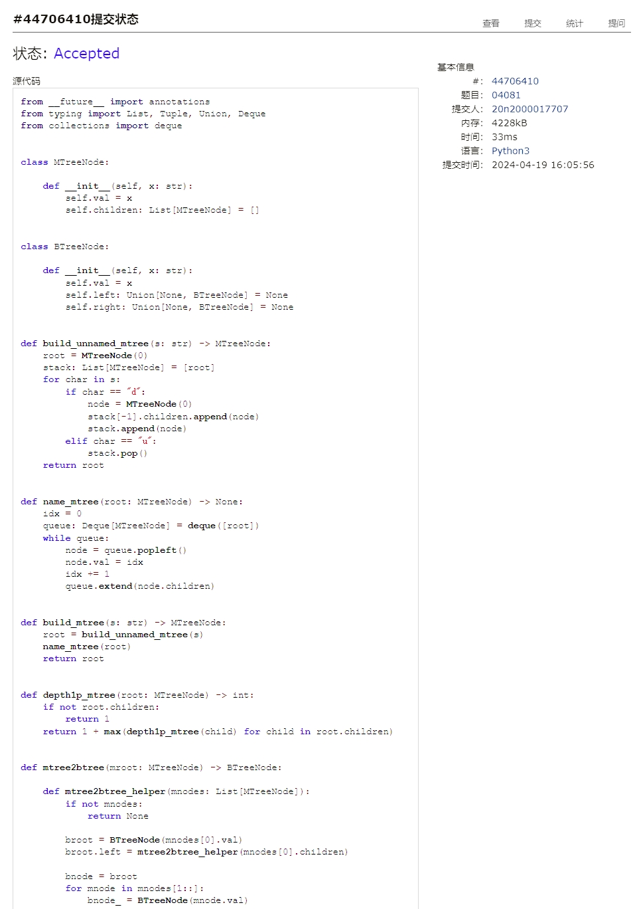
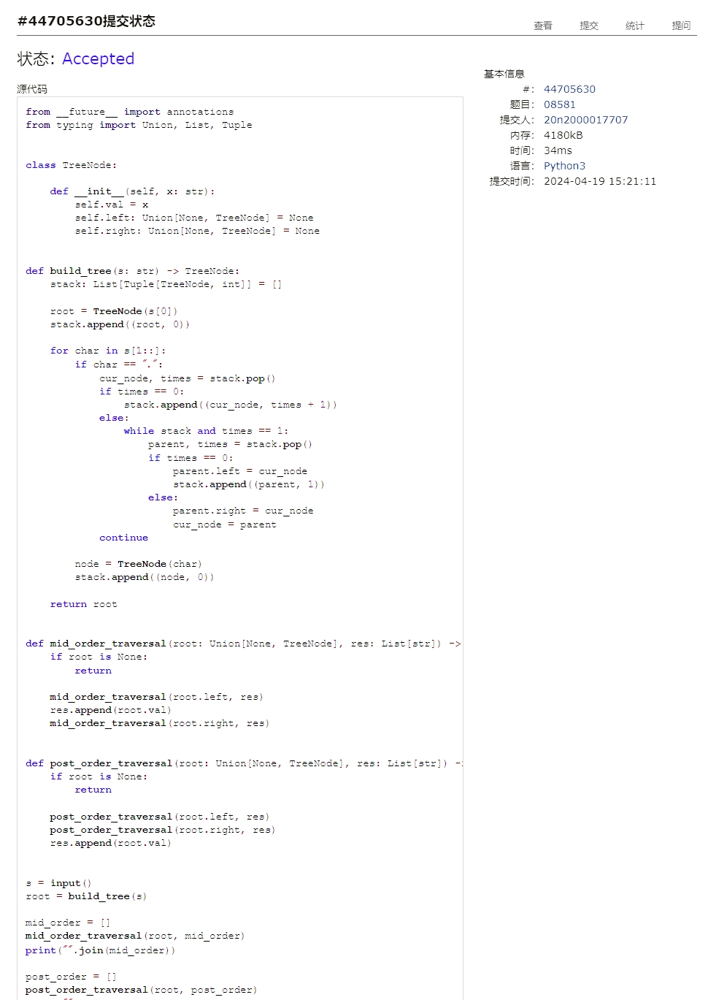
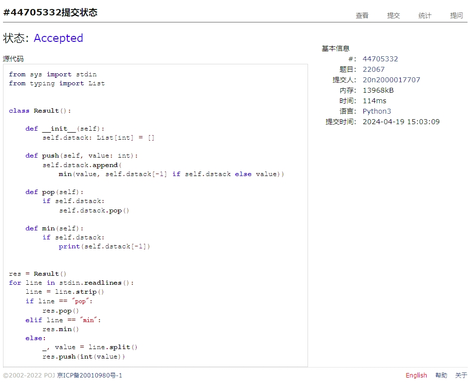
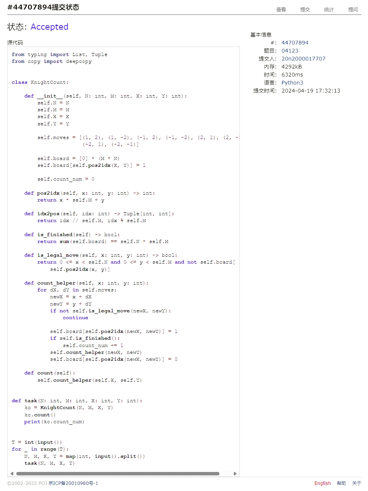
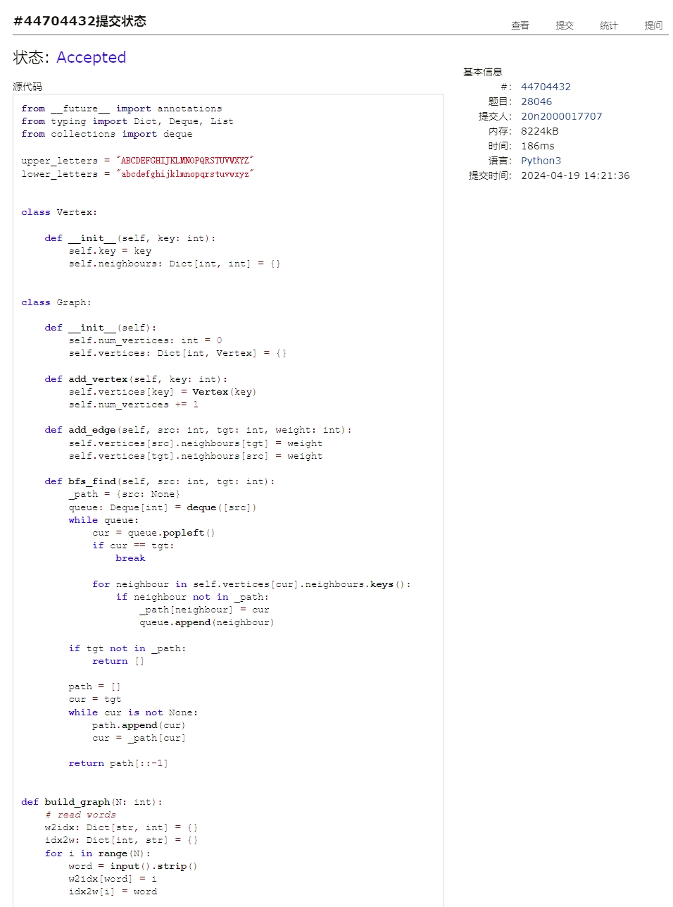
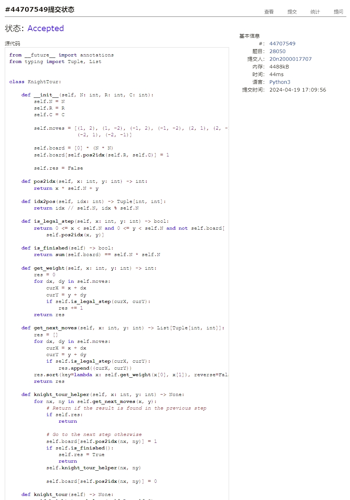

# Assignment #9: 图论：遍历，及 树算

Updated 1739 GMT+8 Apr 14, 2024

2024 spring, Complied by Cat2Li

**说明：**

1）请把每个题目解题思路（可选），源码Python, 或者C++（已经在Codeforces/Openjudge上AC），截图（包含Accepted），填写到下面作业模版中（推荐使用 typora <https://typoraio.cn> ，或者用word）。AC 或者没有AC，都请标上每个题目大致花费时间。

2）提交时候先提交pdf文件，再把md或者doc文件上传到右侧“作业评论”。Canvas需要有同学清晰头像、提交文件有pdf、"作业评论"区有上传的md或者doc附件。

3）如果不能在截止前提交作业，请写明原因。

**编程环境**

==（请改为同学的操作系统、编程环境等）==

操作系统：Ubuntu 22.04.4 LTS

Python编程环境：VS Code 1.88.1; Python 3.12.3

C/C++编程环境：VS Code 1.88.1; gcc (Ubuntu 11.4.0-1ubuntu1~22.04) 11.4.0

## 1. 题目

### 04081: 树的转换

<http://cs101.openjudge.cn/dsapre/04081/>

思路：

代码

```python
from __future__ import annotations
from typing import List, Tuple, Union, Deque
from collections import deque


class MTreeNode:

    def __init__(self, x: str):
        self.val = x
        self.children: List[MTreeNode] = []


class BTreeNode:

    def __init__(self, x: str):
        self.val = x
        self.left: Union[None, BTreeNode] = None
        self.right: Union[None, BTreeNode] = None


def build_unnamed_mtree(s: str) -> MTreeNode:
    root = MTreeNode(0)
    stack: List[MTreeNode] = [root]
    for char in s:
        if char == "d":
            node = MTreeNode(0)
            stack[-1].children.append(node)
            stack.append(node)
        elif char == "u":
            stack.pop()
    return root


def name_mtree(root: MTreeNode) -> None:
    idx = 0
    queue: Deque[MTreeNode] = deque([root])
    while queue:
        node = queue.popleft()
        node.val = idx
        idx += 1
        queue.extend(node.children)


def build_mtree(s: str) -> MTreeNode:
    root = build_unnamed_mtree(s)
    name_mtree(root)
    return root


def depth1p_mtree(root: MTreeNode) -> int:
    if not root.children:
        return 1
    return 1 + max(depth1p_mtree(child) for child in root.children)


def mtree2btree(mroot: MTreeNode) -> BTreeNode:

    def mtree2btree_helper(mnodes: List[MTreeNode]):
        if not mnodes:
            return None

        broot = BTreeNode(mnodes[0].val)
        broot.left = mtree2btree_helper(mnodes[0].children)

        bnode = broot
        for mnode in mnodes[1::]:
            bnode_ = BTreeNode(mnode.val)
            bnode.right = bnode_
            bnode = bnode_
            bnode.left = mtree2btree_helper(mnode.children)
        return broot

    broot = BTreeNode(mroot.val)
    broot.left = mtree2btree_helper(mroot.children)
    return broot


def depth1p_btree(root: Union[None, BTreeNode]) -> int:
    if root is None:
        return 0
    return 1 + max(depth1p_btree(root.left), depth1p_btree(root.right))


s = input()
mroot = build_mtree(s)
mroot_depth = depth1p_mtree(mroot) - 1
broot = mtree2btree(mroot)
broot_depth = depth1p_btree(broot) - 1
print(f"{mroot_depth} => {broot_depth}")
```

代码运行截图 ==（至少包含有"Accepted"）==


### 08581: 扩展二叉树

<http://cs101.openjudge.cn/dsapre/08581/>

思路：

代码

```python
from __future__ import annotations
from typing import Union, List, Tuple


class TreeNode:

    def __init__(self, x: str):
        self.val = x
        self.left: Union[None, TreeNode] = None
        self.right: Union[None, TreeNode] = None


def build_tree(s: str) -> TreeNode:
    stack: List[Tuple[TreeNode, int]] = []

    root = TreeNode(s[0])
    stack.append((root, 0))

    for char in s[1::]:
        if char == ".":
            cur_node, times = stack.pop()
            if times == 0:
                stack.append((cur_node, times + 1))
            else:
                while stack and times == 1:
                    parent, times = stack.pop()
                    if times == 0:
                        parent.left = cur_node
                        stack.append((parent, 1))
                    else:
                        parent.right = cur_node
                        cur_node = parent
            continue

        node = TreeNode(char)
        stack.append((node, 0))

    return root


def mid_order_traversal(root: Union[None, TreeNode], res: List[str]) -> None:
    if root is None:
        return

    mid_order_traversal(root.left, res)
    res.append(root.val)
    mid_order_traversal(root.right, res)


def post_order_traversal(root: Union[None, TreeNode], res: List[str]) -> None:
    if root is None:
        return

    post_order_traversal(root.left, res)
    post_order_traversal(root.right, res)
    res.append(root.val)


s = input()
root = build_tree(s)

mid_order = []
mid_order_traversal(root, mid_order)
print("".join(mid_order))

post_order = []
post_order_traversal(root, post_order)
print("".join(post_order))
```

代码运行截图 ==（至少包含有"Accepted"）==


### 22067: 快速堆猪

<http://cs101.openjudge.cn/practice/22067/>

思路：单调栈

代码

```python
from sys import stdin
from typing import List


class Result():

    def __init__(self):
        self.dstack: List[int] = []

    def push(self, value: int):
        self.dstack.append(
            min(value, self.dstack[-1] if self.dstack else value))

    def pop(self):
        if self.dstack:
            self.dstack.pop()

    def min(self):
        if self.dstack:
            print(self.dstack[-1])


res = Result()
for line in stdin.readlines():
    line = line.strip()
    if line == "pop":
        res.pop()
    elif line == "min":
        res.min()
    else:
        _, value = line.split()
        res.push(int(value))
```

代码运行截图 ==（AC代码截图，至少包含有"Accepted"）==


### 04123: 马走日

dfs, <http://cs101.openjudge.cn/practice/04123>

思路：

代码

```python
from typing import List, Tuple
from copy import deepcopy


class KnightCount:

    def __init__(self, N: int, M: int, X: int, Y: int):
        self.N = N
        self.M = M
        self.X = X
        self.Y = Y

        self.moves = [(1, 2), (1, -2), (-1, 2), (-1, -2), (2, 1), (2, -1),
                      (-2, 1), (-2, -1)]

        self.board = [0] * (M * N)
        self.board[self.pos2idx(X, Y)] = 1

        self.count_num = 0

    def pos2idx(self, x: int, y: int) -> int:
        return x * self.M + y

    def idx2pos(self, idx: int) -> Tuple[int, int]:
        return idx // self.M, idx % self.M

    def is_finished(self) -> bool:
        return sum(self.board) == self.N * self.M

    def is_legal_move(self, x: int, y: int) -> bool:
        return 0 <= x < self.N and 0 <= y < self.M and not self.board[
            self.pos2idx(x, y)]

    def count_helper(self, x: int, y: int):
        for dX, dY in self.moves:
            newX = x + dX
            newY = y + dY
            if not self.is_legal_move(newX, newY):
                continue

            self.board[self.pos2idx(newX, newY)] = 1
            if self.is_finished():
                self.count_num += 1
            self.count_helper(newX, newY)
            self.board[self.pos2idx(newX, newY)] = 0

    def count(self):
        self.count_helper(self.X, self.Y)


def task(N: int, M: int, X: int, Y: int):
    kc = KnightCount(N, M, X, Y)
    kc.count()
    print(kc.count_num)


T = int(input())
for _ in range(T):
    N, M, X, Y = map(int, input().split())
    task(N, M, X, Y)
```

代码运行截图 ==（AC代码截图，至少包含有"Accepted"）==


### 28046: 词梯

bfs, <http://cs101.openjudge.cn/practice/28046/>

思路：

代码

```python
from __future__ import annotations
from typing import Dict, Deque, List
from collections import deque

upper_letters = "ABCDEFGHIJKLMNOPQRSTUVWXYZ"
lower_letters = "abcdefghijklmnopqrstuvwxyz"


class Vertex:

    def __init__(self, key: int):
        self.key = key
        self.neighbours: Dict[int, int] = {}


class Graph:

    def __init__(self):
        self.num_vertices: int = 0
        self.vertices: Dict[int, Vertex] = {}

    def add_vertex(self, key: int):
        self.vertices[key] = Vertex(key)
        self.num_vertices += 1

    def add_edge(self, src: int, tgt: int, weight: int):
        self.vertices[src].neighbours[tgt] = weight
        self.vertices[tgt].neighbours[src] = weight

    def bfs_find(self, src: int, tgt: int):
        _path = {src: None}
        queue: Deque[int] = deque([src])
        while queue:
            cur = queue.popleft()
            if cur == tgt:
                break

            for neighbour in self.vertices[cur].neighbours.keys():
                if neighbour not in _path:
                    _path[neighbour] = cur
                    queue.append(neighbour)

        if tgt not in _path:
            return []

        path = []
        cur = tgt
        while cur is not None:
            path.append(cur)
            cur = _path[cur]

        return path[::-1]


def build_graph(N: int):
    # read words
    w2idx: Dict[str, int] = {}
    idx2w: Dict[int, str] = {}
    for i in range(N):
        word = input().strip()
        w2idx[word] = i
        idx2w[i] = word

    # initialize graph
    graph = Graph()
    for i in range(N):
        graph.add_vertex(i)

    # set letters
    if word[0].isupper():
        letters = upper_letters
    else:
        letters = lower_letters

    # add edges
    for word in w2idx.keys():
        for i in range(len(word)):
            for letter in letters:
                # skip if the letter is the same as the one in the word
                if letter == word[i]:
                    continue
                # try to add edges between word and new_word
                new_word = word[:i] + letter + word[i + 1:]
                if new_word in w2idx:
                    graph.add_edge(w2idx[word], w2idx[new_word], 1)

    return w2idx, idx2w, graph


def output_path(idx2w: Dict[str, int], path: List[int]):
    if path:
        print(" ".join([idx2w[idx] for idx in path]))
    else:
        print("NO")


if __name__ == "__main__":
    N = int(input())
    W, I, G = build_graph(N)
    src, tgt = input().strip().split()
    path = G.bfs_find(W[src], W[tgt])
    output_path(I, path)
```

代码运行截图 ==（AC代码截图，至少包含有"Accepted"）==


### 28050: 骑士周游

dfs, <http://cs101.openjudge.cn/practice/28050/>

思路：

代码

```python
from __future__ import annotations
from typing import Tuple, List
import sys

sys.setrecursionlimit(100000)


class KnightTour:

    def __init__(self, N: int, R: int, C: int):
        self.N = N
        self.R = R
        self.C = C

        self.moves = [(1, 2), (1, -2), (-1, 2), (-1, -2), (2, 1), (2, -1),
                      (-2, 1), (-2, -1)]

        self.board = [0] * (N * N)
        self.board[self.pos2idx(self.R, self.C)] = 1

        self.res = False

    def pos2idx(self, x: int, y: int) -> int:
        return x * self.N + y

    def idx2pos(self, idx: int) -> Tuple[int, int]:
        return idx // self.N, idx % self.N

    def is_legal_step(self, x: int, y: int) -> bool:
        return 0 <= x < self.N and 0 <= y < self.N and not self.board[
            self.pos2idx(x, y)]

    def is_finished(self) -> bool:
        return sum(self.board) == self.N * self.N

    def get_weight(self, x: int, y: int) -> int:
        res = 0
        for dx, dy in self.moves:
            curX = x + dx
            curY = y + dy
            if self.is_legal_step(curX, curY):
                res += 1
        return res

    def get_next_moves(self, x: int, y: int) -> List[Tuple[int, int]]:
        res = []
        for dx, dy in self.moves:
            curX = x + dx
            curY = y + dy
            if self.is_legal_step(curX, curY):
                res.append((curX, curY))
        res.sort(key=lambda x: self.get_weight(x[0], x[1]), reverse=False)
        return res

    def knight_tour_helper(self, x: int, y: int) -> None:
        for nx, ny in self.get_next_moves(x, y):
            # Return if the result is found in the previous step
            if self.res:
                return

            # Go to the next step otherwise
            self.board[self.pos2idx(nx, ny)] = 1
            if self.is_finished():
                self.res = True
                return
            self.knight_tour_helper(nx, ny)

            # Backtrack
            self.board[self.pos2idx(nx, ny)] = 0

    def knight_tour(self) -> None:
        self.knight_tour_helper(self.R, self.C)


N = int(input())
R, C = map(int, input().split())

kt = KnightTour(N, R, C)
kt.knight_tour()
print("success" if kt.res else "fail")
```

代码运行截图 ==（AC代码截图，至少包含有"Accepted"）==


## 2. 学习总结和收获

==如果作业题目简单，有否额外练习题目，比如：OJ“2024spring每日选做”、CF、LeetCode、洛谷等网站题目。==
因为复习期中代码写少了，再打开作业就感觉手生了！
看来还得多加练习x
