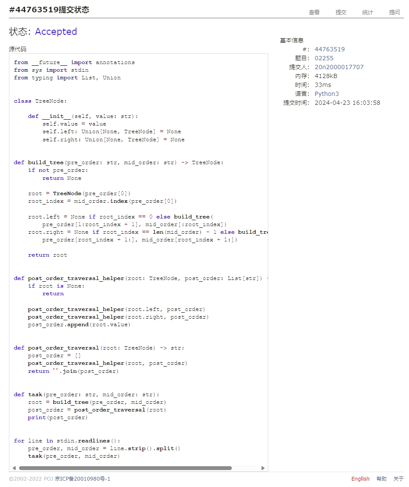

# Assignment #A: 图论：遍历，树算及栈

Updated 2018 GMT+8 Apr 21, 2024

2024 spring, Complied by Cat2Li

**说明：**

1）请把每个题目解题思路（可选），源码Python, 或者C++（已经在Codeforces/Openjudge上AC），截图（包含Accepted），填写到下面作业模版中（推荐使用 typora <https://typoraio.cn> ，或者用word）。AC 或者没有AC，都请标上每个题目大致花费时间。

2）提交时候先提交pdf文件，再把md或者doc文件上传到右侧“作业评论”。Canvas需要有同学清晰头像、提交文件有pdf、"作业评论"区有上传的md或者doc附件。

3）如果不能在截止前提交作业，请写明原因。

**编程环境**

==（请改为同学的操作系统、编程环境等）==

操作系统：Ubuntu 22.04.4 LTS

Python编程环境：VS Code 1.88.1; Python 3.12.3

C/C++编程环境：VS Code 1.88.1; gcc (Ubuntu 11.4.0-1ubuntu1~22.04) 11.4.0

## 1. 题目

### 20743: 整人的提词本

<http://cs101.openjudge.cn/practice/20743/>

思路：

代码

```python
from typing import List

s = input()
stack: List[str] = []
tmp: List[str] = []
for char in s:
    if char == ")":
        while char != "(":
            char = stack.pop()
            tmp.append(char)

        tmp.pop()
        stack.extend(tmp)
        tmp.clear()
        continue
    stack.append(char)

print(''.join(stack))
```

代码运行截图 ==（至少包含有"Accepted"）==


### 02255: 重建二叉树

<http://cs101.openjudge.cn/practice/02255/>

思路：

代码

```python
from __future__ import annotations
from sys import stdin
from typing import List, Union


class TreeNode:

    def __init__(self, value: str):
        self.value = value
        self.left: Union[None, TreeNode] = None
        self.right: Union[None, TreeNode] = None


def build_tree(pre_order: str, mid_order: str) -> TreeNode:
    if not pre_order:
        return None

    root = TreeNode(pre_order[0])
    root_index = mid_order.index(pre_order[0])

    root.left = None if root_index == 0 else build_tree(
        pre_order[1:root_index + 1], mid_order[:root_index])
    root.right = None if root_index == len(mid_order) - 1 else build_tree(
        pre_order[root_index + 1:], mid_order[root_index + 1:])

    return root

def post_order_traversal(root: TreeNode) -> str:
    
    def post_order_traversal_helper(root: TreeNode, post_order: List[str]) -> None:
        if root is None:
            return

        post_order_traversal_helper(root.left, post_order)
        post_order_traversal_helper(root.right, post_order)
        post_order.append(root.value)

    post_order = []
    post_order_traversal_helper(root, post_order)
    return ''.join(post_order)


def task(pre_order: str, mid_order: str):
    root = build_tree(pre_order, mid_order)
    post_order = post_order_traversal(root)
    print(post_order)


for line in stdin.readlines():
    pre_order, mid_order = line.strip().split()
    task(pre_order, mid_order)
```

代码运行截图 ==（至少包含有"Accepted"）==


### 01426: Find The Multiple

<http://cs101.openjudge.cn/practice/01426/>

要求用bfs实现

思路：

代码

```python
from typing import List, Set, Tuple, Deque
from collections import deque


def task(n: int):
    q: Deque[int] = deque()
    q.append((1 % n, "1"))
    visited: Set[int] = set([1 % n])

    while q:
        mod, s = q.popleft()
        if mod == 0:
            print(s)
            return

        for digit in [0, 1]:
            new_mod = (mod * 10 + digit) % n
            new_s = s + str(digit)

            if new_mod not in visited:
                visited.add(new_mod)
                q.append((new_mod, new_s))


while True:
    if (n := int(input())) == 0:
        break
    task(n)
```

代码运行截图 ==（AC代码截图，至少包含有"Accepted"）==


### 04115: 鸣人和佐助

bfs, <http://cs101.openjudge.cn/practice/04115/>

思路：BFS
我的代码不是最好的解法，但是应对这个题是够的。

状态是（当前位置，剩余的查克拉，步数）
构建字典（当前位置，剩余的查克拉）-> 最小步数
如果发现（当前位置，剩余的查克拉）已经在字典中，且步数更小，就跳过 BFS。

但有一个重要问题：
考虑如下遍历，从 UR 开始，BFS 遍历 UL 和 DR，之后 UL 和 DR 遍历回 UR，此时（当前位置，剩余的查克拉 + 2）在字典中，且步数更小，而（当前位置，剩余的查克拉）不在字典中。
\#(UL) \#(UR)
\#(DL) \#(DR)
还有可能从 UR-UL-DL 绕一圈之后回到 UR，此时（当前位置，剩余的查克拉 + 2）在字典中，且步数更小，而（当前位置，剩余的查克拉）不在字典中。

所以我们每次更新最小步数的时候，需要把剩余能量更低的状态的最小步数也更新；这样能避免空跑。
这样在 T 比较大的时候会有帮助，但本题 T 不大，所以最后耗时优化不大。

代码

```python
from collections import deque
from typing import Tuple, List

m, n, t = map(int, input().split())
arr = [input() for _ in range(m)]


def is_valid(x: int, y: int):
    return 0 <= x < m and 0 <= y < n


def find(char: str) -> Tuple[int, int]:
    for i in range(m):
        for j in range(n):
            if arr[i][j] == char:
                return (i, j)
    raise ValueError(f"Character {char} not found")


mr_x, mr_y = find("@")
zz_x, zz_y = find("+")


def bfs():
    q = deque()
    min_step: List[List[int]] = [[10**6] * (t + 1) for _ in range(m * n)]

    # state: (lastchr, pos, left, step)
    ## pos: x * N + y
    ## left: energy left
    ## step: steps taken

    q.append((mr_x * n + mr_y, t, 0))
    while q:
        pos, left, step = q.popleft()

        if min_step[pos][left] > step:
            for energy in range(left + 1):
                min_step[pos][energy] = step
        else:
            continue

        x, y = pos // n, pos % n

        for dx, dy in [(0, 1), (0, -1), (1, 0), (-1, 0)]:
            nx, ny = x + dx, y + dy
            if is_valid(nx, ny):
                if (nx, ny) == (zz_x, zz_y):
                    return step + 1

                npos = nx * n + ny
                nleft = left - 1 if arr[nx][ny] == "#" else left
                if nleft < 0:
                    continue

                q.append((npos, nleft, step + 1))

    return -1


print(bfs())
```

代码运行截图 ==（AC代码截图，至少包含有"Accepted"）==


### 20106: 走山路

Dijkstra, <http://cs101.openjudge.cn/practice/20106/>

思路：

代码

```python
import heapq
from typing import List, Tuple, Dict

M, N, P = map(int, input().split())


def build_grid(M: int, N: int) -> List[List[str]]:
    grid = []
    for _ in range(M):
        grid.append(input().split())
    return grid


def is_valid(x: int, y: int):
    return 0 <= x < M and 0 <= y < N and grid[x][y] != '#'


def cost(x: int, y: int, nx: int, ny: int):
    return abs(int(grid[nx][ny]) - int(grid[x][y]))


def task(sx, sy, tx, ty):
    if not is_valid(sx, sy) or not is_valid(tx, ty):
        print('NO')
        return

    pq = []
    visited = [[False] * N for _ in range(M)]

    heapq.heappush(pq, (0, sx, sy))
    while pq:
        step, x, y = heapq.heappop(pq)

        if visited[x][y]:
            continue

        visited[x][y] = True

        if (x, y) == (tx, ty):
            print(step)
            return

        for dx, dy in [(0, 1), (0, -1), (1, 0), (-1, 0)]:
            nx, ny = x + dx, y + dy
            if is_valid(nx, ny):
                heapq.heappush(pq, (step + cost(x, y, nx, ny), nx, ny))

    print('NO')


grid = build_grid(M, N)
for _ in range(P):
    sx, sy, tx, ty = map(int, input().split())
    task(sx, sy, tx, ty)
```

代码运行截图 ==（AC代码截图，至少包含有"Accepted"）==


### 05442: 兔子与星空

Prim, <http://cs101.openjudge.cn/practice/05442/>

思路：

利用并查集优化的 Kruskal 算法，理论时间复杂度为 O(E log E)，而且决速步在堆的操作上。
高度优化的 Prim 算法需要用到 IndexedPriorityQueue （但太复杂了懒得写），理论时间复杂度为 O(E log V)，对稀疏图更友好。

代码

```python
from __future__ import annotations
from typing import List, Dict
from numbers import Number
import heapq


class Edge:

    def __init__(self, src: int, tgt: int, weight: Number):
        self.src = src
        self.tgt = tgt
        self.weight = weight

    def __lt__(self, other: Edge):
        return self.weight < other.weight

    def __str__(self):
        return f'Edge({self.src}, {self.tgt}, {self.weight})'


class Graph:

    def __init__(self, N):
        self.__N = N
        self.__edges: List[Edge] = []

    def add_edge(self, src: int, tgt: int, weight: Number):
        self.__edges.append(Edge(src, tgt, weight))

    @property
    def edges(self) -> List[Edge]:
        return self.__edges.copy()

    @property
    def num_vertices(self) -> int:
        return self.__N

    @property
    def num_edges(self) -> int:
        return len(self.__edges)

    def sum_weights(self) -> Number:
        return sum(edge.weight for edge in self.__edges)


class UnionFind:

    def __init__(self, N: int):
        self.N = N
        self.parent: List[int] = [i for i in range(N)]
        self.size: List[int] = [1] * N

    def find(self, x: int) -> int:
        while x != self.parent[x]:
            self.parent[x] = self.parent[self.parent[x]]
            x = self.parent[x]
        return x

    def union(self, x: int, y: int):
        x_root = self.find(x)
        y_root = self.find(y)

        if x_root == y_root:
            return

        if self.size[x_root] < self.size[y_root]:
            self.parent[x_root] = y_root
            self.size[y_root] += self.size[x_root]
        else:
            self.parent[y_root] = x_root
            self.size[x_root] += self.size[y_root]

    def connected(self, x: int, y: int) -> bool:
        return self.find(x) == self.find(y)


def build_graph():
    N = int(input())
    graph = Graph(N)

    for _ in range(N - 1):
        arr = input().split()

        src = ord(arr[0]) - 65
        num_inputs = int(arr[1])
        for j in range(2, num_inputs * 2 + 2, 2):
            tgt = ord(arr[j]) - 65
            weight = int(arr[j + 1])

            graph.add_edge(src, tgt, weight)

    return graph


def kruskal(graph: Graph):
    uf = UnionFind(graph.num_vertices)
    pq: List[Edge] = graph.edges
    mst: Graph = Graph(graph.num_vertices)
    heapq.heapify(pq)

    while pq and mst.num_edges < graph.num_vertices - 1:
        edge = heapq.heappop(pq)
        if not uf.connected(edge.src, edge.tgt):
            uf.union(edge.src, edge.tgt)
            mst.add_edge(edge.src, edge.tgt, edge.weight)

    return mst


graph = build_graph()
mst = kruskal(graph)
print(mst.sum_weights())
```

代码运行截图 ==（AC代码截图，至少包含有"Accepted"）==


## 2. 学习总结和收获

==如果作业题目简单，有否额外练习题目，比如：OJ“2024spring每日选做”、CF、LeetCode、洛谷等网站题目。==
作业题目不简单，花了不少时间；鸣人和佐助想了很久想到 Optimal 的算法，很有成就感！
