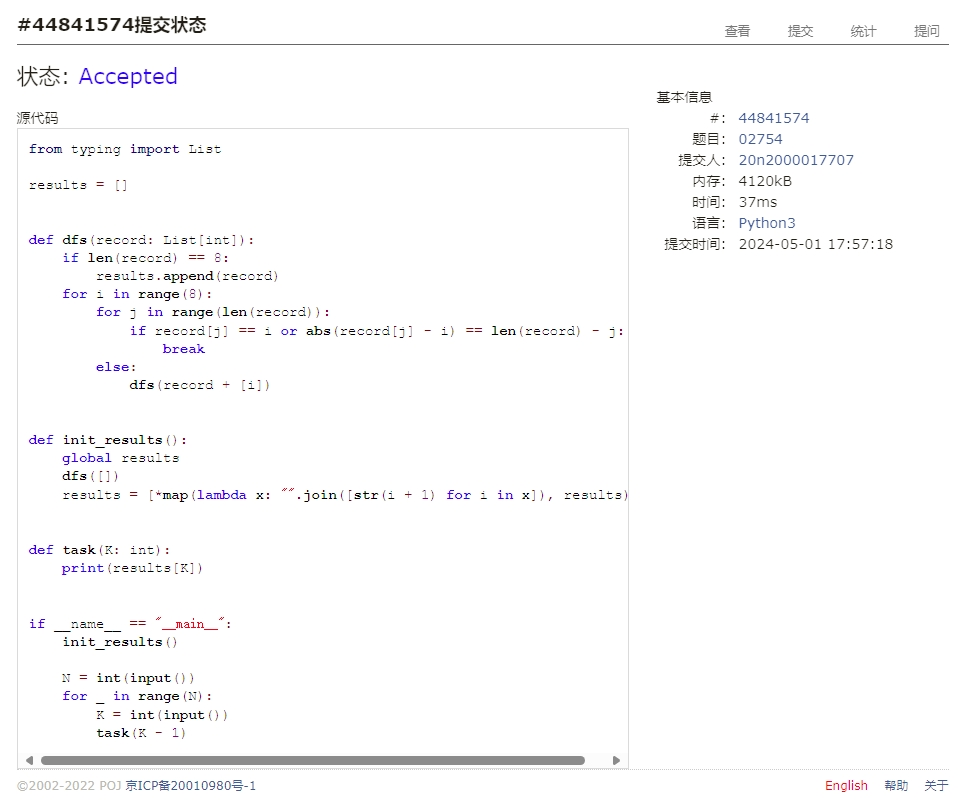

# Assignment #B: 图论和树算

Updated 1709 GMT+8 Apr 28, 2024

2024 spring, Complied by Cat2Li

**说明：**

1）请把每个题目解题思路（可选），源码Python, 或者C++（已经在Codeforces/Openjudge上AC），截图（包含Accepted），填写到下面作业模版中（推荐使用 typora <https://typoraio.cn> ，或者用word）。AC 或者没有AC，都请标上每个题目大致花费时间。

2）提交时候先提交pdf文件，再把md或者doc文件上传到右侧“作业评论”。Canvas需要有同学清晰头像、提交文件有pdf、"作业评论"区有上传的md或者doc附件。

3）如果不能在截止前提交作业，请写明原因。

**编程环境**

==（请改为同学的操作系统、编程环境等）==

操作系统：Ubuntu 22.04.4 LTS

Python编程环境：VS Code 1.89.0; Python 3.12.3

C/C++编程环境：VS Code 1.89.0; gcc (Ubuntu 11.4.0-1ubuntu1~22.04) 11.4.0

## 1. 题目

### 28170: 算鹰

dfs, <http://cs101.openjudge.cn/practice/28170/>

思路：

代码

```python
grid = [input() for _ in range(10)]
visited = [[False] * 10 for _ in range(10)]


def dfs(x, y):
    global grid, visited
    visited[x][y] = True
    for dx, dy in [(0, 1), (0, -1), (1, 0), (-1, 0)]:
        nx, ny = x + dx, y + dy
        if 0 <= nx < 10 and 0 <= ny < 10 and grid[nx][
                ny] == "." and not visited[nx][ny]:
            dfs(nx, ny)


count = 0
for x in range(10):
    for y in range(10):
        if grid[x][y] == "." and not visited[x][y]:
            dfs(x, y)
            count += 1

print(count)
```

代码运行截图 ==（至少包含有"Accepted"）==


### 02754: 八皇后

dfs, <http://cs101.openjudge.cn/practice/02754/>

思路：

代码

```python
from typing import List

results = []


def dfs(record: List[int]):
    if len(record) == 8:
        results.append(record)
    for i in range(8):
        for j in range(len(record)):
            if record[j] == i or abs(record[j] - i) == len(record) - j:
                break
        else:
            dfs(record + [i])


def init_results():
    global results
    dfs([])
    results = [*map(lambda x: "".join([str(i + 1) for i in x]), results)]


def task(K: int):
    print(results[K])


if __name__ == "__main__":
    init_results()

    N = int(input())
    for _ in range(N):
        K = int(input())
        task(K - 1)
```

代码运行截图 ==（至少包含有"Accepted"）==


### 03151: Pots

bfs, <http://cs101.openjudge.cn/practice/03151/>

思路：

代码

```python
from collections import deque
from typing import Tuple, Deque, Set, List

A, B, C = map(int, input().split())

# A >= B
IDX = [1, 2] if A >= B else [2, 1]
if A < B:
    A, B = B, A
A_IDX = 0
B_IDX = 1

queue: Deque[Tuple[Tuple[int, int], List[str]]] = deque()
visited: Set[Tuple[int, int]] = set()

queue.append(((0, 0), []))
while queue:
    state, ops = queue.popleft()
    if state[0] == C or state[1] == C:
        print(len(ops))
        print("\n".join(ops))
        exit()

    if state in visited:
        continue
    visited.add(state)

    # FILL
    queue.append(((A, state[1]), ops + [f"FILL({IDX[A_IDX]})"]))
    queue.append(((state[0], B), ops + [f"FILL({IDX[B_IDX]})"]))

    # DROP
    queue.append(((0, state[1]), ops + [f"DROP({IDX[A_IDX]})"]))
    queue.append(((state[0], 0), ops + [f"DROP({IDX[B_IDX]})"]))

    # POUR
    ## A to B
    out = min(B - state[1], state[0])
    queue.append(((state[0] - out, state[1] + out),
                  ops + [f"POUR({IDX[A_IDX]},{IDX[B_IDX]})"]))
    ## B to A
    out = min(A - state[0], state[1])
    queue.append(((state[0] + out, state[1] - out),
                  ops + [f"POUR({IDX[B_IDX]},{IDX[A_IDX]})"]))

print("impossible")
```

代码运行截图 ==（AC代码截图，至少包含有"Accepted"）==


### 05907: 二叉树的操作

<http://cs101.openjudge.cn/practice/05907/>

思路：

代码

```python
from __future__ import annotations
from typing import Union, List


class TreeNode:

    def __init__(self, x: int):
        self.val = x
        self.parent: Union[TreeNode, None] = None
        self.left: Union[TreeNode, None] = None
        self.right: Union[TreeNode, None] = None

    def set_parent(self, parent: TreeNode):
        assert self.parent is None
        self.parent = parent

    def update_child(self, orig: TreeNode, new: TreeNode):
        if self.left is orig:
            self.left = new
        elif self.right is orig:
            self.right = new
        else:
            raise ValueError("Orig is not child of node")
        new.parent = self


def build_tree(N: int):
    nodes = [TreeNode(i) for i in range(N)]
    for _ in range(N):
        X, Y, Z = map(int, input().split())
        if Y != -1:
            nodes[X].left = nodes[Y]
            nodes[Y].set_parent(nodes[X])
        if Z != -1:
            nodes[X].right = nodes[Z]
            nodes[Z].set_parent(nodes[X])
    return nodes


def manipulate(M: int, nodes: List[TreeNode]):
    for _ in range(M):
        ty, *arg = map(int, input().split())
        if ty == 1:
            either = nodes[arg[0]]
            other = nodes[arg[1]]

            p_either = either.parent
            p_other = other.parent

            if id(p_either) == id(p_other):
                p_either.left, p_either.right = p_either.right, p_either.left
            else:
                p_either.update_child(either, other)
                p_other.update_child(other, either)

        elif ty == 2:
            node = nodes[arg[0]]

            while node.left is not None:
                node = node.left

            print(node.val)

        else:
            raise ValueError


if __name__ == "__main__":
    T = int(input())
    for _ in range(T):
        N, M = map(int, input().split())
        nodes = build_tree(N)
        manipulate(M, nodes)
```

代码运行截图 ==（AC代码截图，至少包含有"Accepted"）==


### 18250: 冰阔落 I

Disjoint set, <http://cs101.openjudge.cn/practice/18250/>

思路：

代码

```python
from typing import List


class UnionFind:

    def __init__(self, N: int):
        self.N = N
        self.parent = list(range(N))

    def find(self, a: int) -> int:
        while a != self.parent[a]:
            self.parent[a] = self.parent[self.parent[a]]
            a = self.parent[a]
        return a

    def union(self, a: int, b: int):
        a = self.find(a)
        b = self.find(b)
        self.parent[b] = a

    def connected(self, a: int, b: int) -> bool:
        return self.find(a) == self.find(b)

    def unique(self) -> List[int]:
        return sorted(set(self.find(i) for i in range(self.N)))


while True:
    try:
        N, M = map(int, input().split())
        uf = UnionFind(N)

        for _ in range(M):
            x, y = map(int, input().split())
            if uf.connected(x - 1, y - 1):
                print("Yes")
            else:
                uf.union(x - 1, y - 1)
                print("No")

        unique = uf.unique()
        print(len(unique))
        print(*[i + 1 for i in unique])
    except EOFError:
        break
```

代码运行截图 ==（AC代码截图，至少包含有"Accepted"）==


### 05443: 兔子与樱花

<http://cs101.openjudge.cn/practice/05443/>

思路：

代码

```python
from __future__ import annotations
from typing import Dict, List, Tuple
from numbers import Number
import heapq

PlaceName = str
PlaceNo = int


class Graph:

    def __init__(self, N: int):
        self.N = N
        self.edges: List[Dict[PlaceNo, Number]] = [{} for _ in range(N)]

    def add_edge(self, src: PlaceNo, dest: PlaceNo, dist: Number):
        self.edges[src][dest] = dist
        self.edges[dest][src] = dist

    def dijkstra(self, src: PlaceNo, dest: PlaceNo) -> List[PlaceNo]:
        queue: List[Tuple[Number, List[PlaceNo]]] = [(0, [src])]
        while queue:
            dist, path = heapq.heappop(queue)
            last = path[-1]
            if last == dest:
                return path
            for to, weight in self.edges[last].items():
                if to not in path:
                    heapq.heappush(queue, (dist + weight, path + [to]))
        raise ValueError("No path found")


d_place: Dict[PlaceName, PlaceNo] = {}
d_no: List[PlaceName] = []

P = int(input())
for i in range(P):
    place_name = input()
    d_place[place_name] = i
    d_no.append(place_name)
g = Graph(P)

Q = int(input())
for _ in range(Q):
    either, other, dist = input().split()
    dist = int(dist)

    either_no = d_place[either]
    other_no = d_place[other]

    g.add_edge(either_no, other_no, dist)


def output_path(path: List[PlaceNo]):
    global g, d_no
    res: List[str] = [d_no[path[0]]]
    for i in range(1, len(path)):
        res.append(f"->({g.edges[path[i-1]][path[i]]})->{d_no[path[i]]}")
    print("".join(res))


R = int(input())
for _ in range(R):
    src, dest = input().split()

    src_no = d_place[src]
    dest_no = d_place[dest]

    path = g.dijkstra(src_no, dest_no)
    output_path(path)
```

代码运行截图 ==（AC代码截图，至少包含有"Accepted"）==


## 2. 学习总结和收获

==如果作业题目简单，有否额外练习题目，比如：OJ“2024spring每日选做”、CF、LeetCode、洛谷等网站题目。==
放假一周，开始收收心继续学习！
题目不简单，故无额外练习（）
