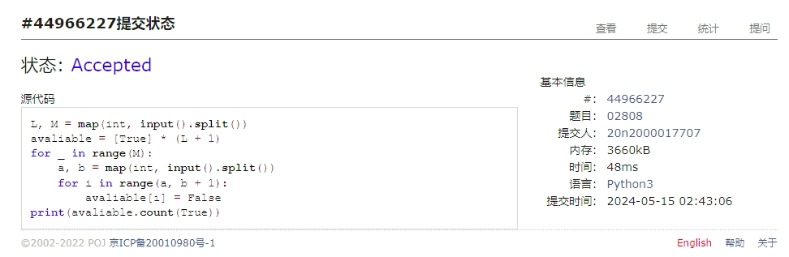
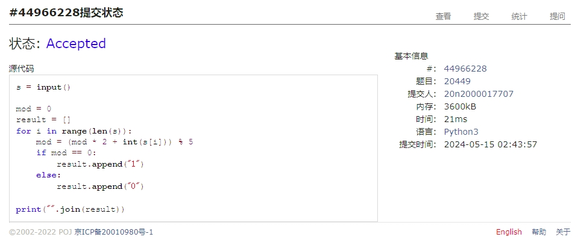
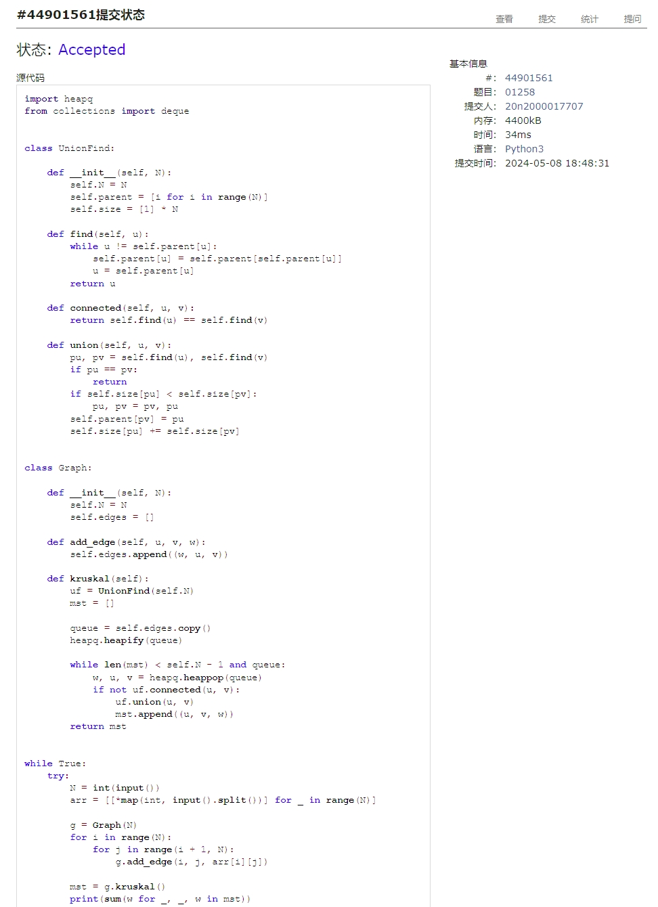
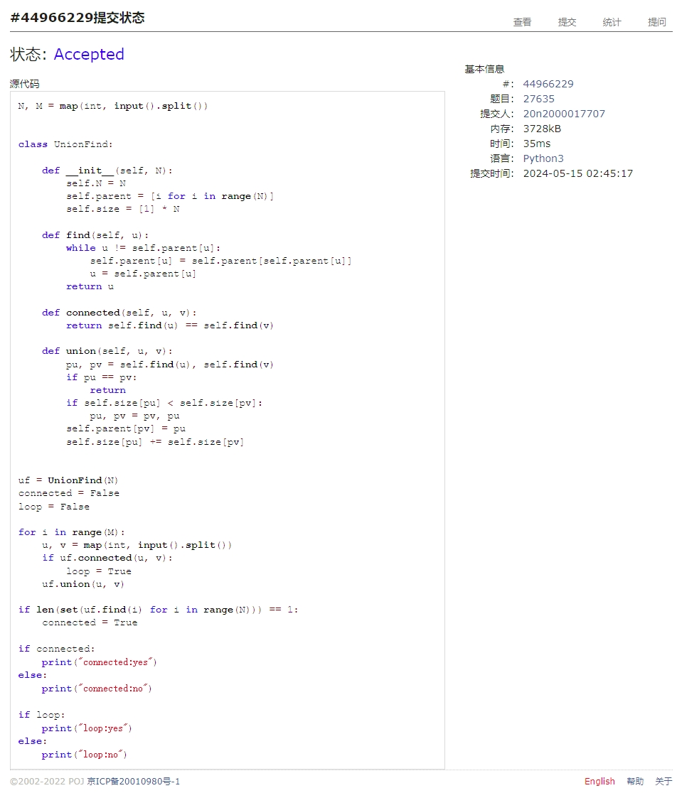
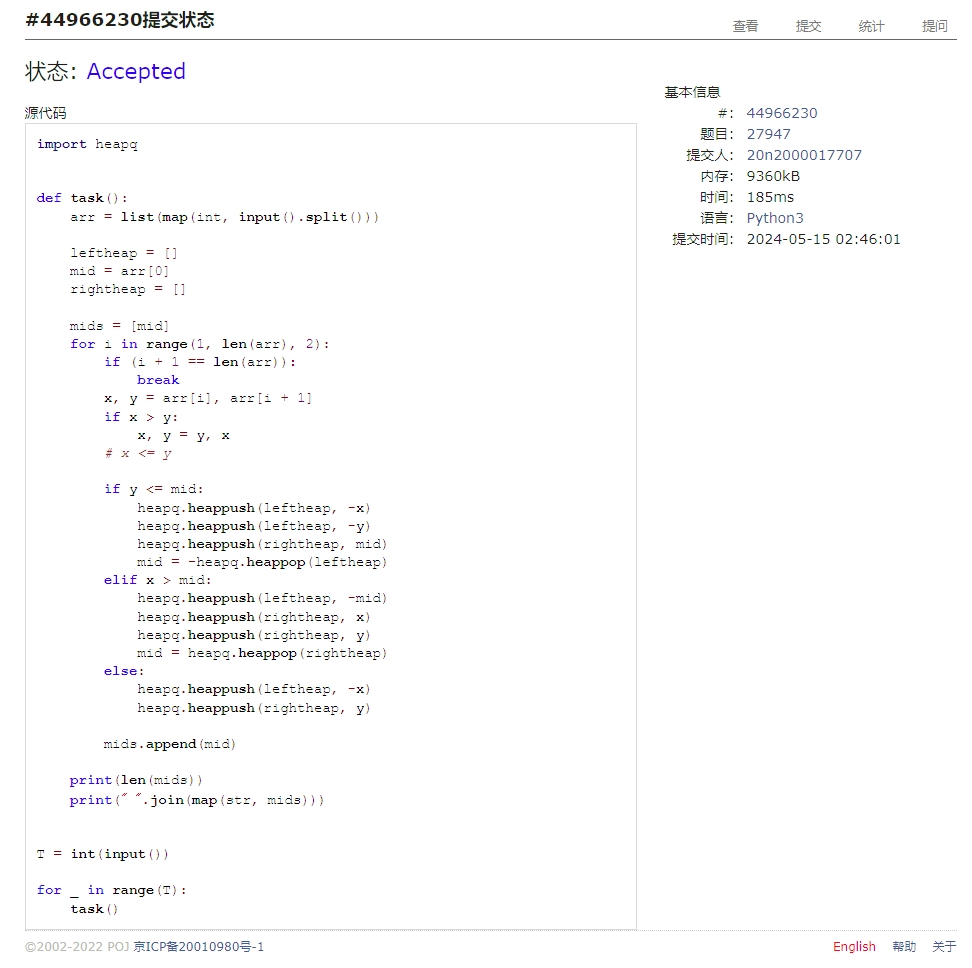
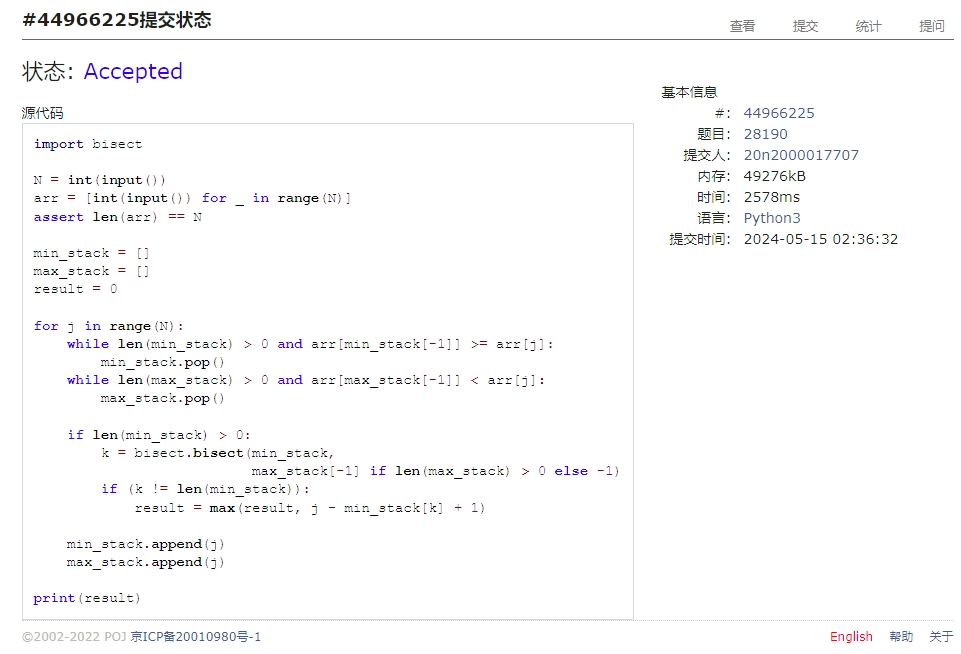

# Assignment #D: May月考

Updated 1654 GMT+8 May 8, 2024

2024 spring, Complied by Cat2Li

**说明：**

1）请把每个题目解题思路（可选），源码Python, 或者C++（已经在Codeforces/Openjudge上AC），截图（包含Accepted），填写到下面作业模版中（推荐使用 typora <https://typoraio.cn> ，或者用word）。AC 或者没有AC，都请标上每个题目大致花费时间。

2）提交时候先提交pdf文件，再把md或者doc文件上传到右侧“作业评论”。Canvas需要有同学清晰头像、提交文件有pdf、"作业评论"区有上传的md或者doc附件。

3）如果不能在截止前提交作业，请写明原因。

**编程环境**

==（请改为同学的操作系统、编程环境等）==

操作系统：Ubuntu 22.04.4 LTS

Python编程环境：VS Code 1.89.0; Python 3.12.3

C/C++编程环境：VS Code 1.89.0; gcc (Ubuntu 11.4.0-1ubuntu1~22.04) 11.4.0

## 1. 题目

### 02808: 校门外的树

<http://cs101.openjudge.cn/practice/02808/>

思路：

代码

```python
L, M = map(int, input().split())
avaliable = [True] * (L + 1)
for _ in range(M):
    a, b = map(int, input().split())
    for i in range(a, b + 1):
        avaliable[i] = False
print(avaliable.count(True))
```

代码运行截图 ==（至少包含有"Accepted"）==


### 20449: 是否被5整除

<http://cs101.openjudge.cn/practice/20449/>

思路：

代码

```python
s = input()

mod = 0
result = []
for i in range(len(s)):
    mod = (mod * 2 + int(s[i])) % 5
    if mod == 0:
        result.append("1")
    else:
        result.append("0")

print("".join(result))
```

代码运行截图 ==（至少包含有"Accepted"）==


### 01258: Agri-Net

<http://cs101.openjudge.cn/practice/01258/>

思路：

代码

```python
import heapq
from collections import deque


class UnionFind:

    def __init__(self, N):
        self.N = N
        self.parent = [i for i in range(N)]
        self.size = [1] * N

    def find(self, u):
        while u != self.parent[u]:
            self.parent[u] = self.parent[self.parent[u]]
            u = self.parent[u]
        return u

    def connected(self, u, v):
        return self.find(u) == self.find(v)

    def union(self, u, v):
        pu, pv = self.find(u), self.find(v)
        if pu == pv:
            return
        if self.size[pu] < self.size[pv]:
            pu, pv = pv, pu
        self.parent[pv] = pu
        self.size[pu] += self.size[pv]


class Graph:

    def __init__(self, N):
        self.N = N
        self.edges = []

    def add_edge(self, u, v, w):
        self.edges.append((w, u, v))

    @staticmethod
    def kruskal(g: Graph):
        uf = UnionFind(self.N)
        mst = []

        queue = self.edges.copy()
        heapq.heapify(queue)

        while len(mst) < self.N - 1 and queue:
            w, u, v = heapq.heappop(queue)
            if not uf.connected(u, v):
                uf.union(u, v)
                mst.append((u, v, w))
        return mst


while True:
    try:
        N = int(input())
        arr = [[*map(int, input().split())] for _ in range(N)]

        g = Graph(N)
        for i in range(N):
            for j in range(i + 1, N):
                g.add_edge(i, j, arr[i][j])

        mst = Graph.kruskal()
        print(sum(w for _, _, w in mst))
    except:
        exit()
```

代码运行截图 ==（AC代码截图，至少包含有"Accepted"）==


### 27635: 判断无向图是否连通有无回路(同23163)

<http://cs101.openjudge.cn/practice/27635/>

思路：

代码

```python
N, M = map(int, input().split())


class UnionFind:

    def __init__(self, N):
        self.N = N
        self.parent = [i for i in range(N)]
        self.size = [1] * N

    def find(self, u):
        while u != self.parent[u]:
            self.parent[u] = self.parent[self.parent[u]]
            u = self.parent[u]
        return u

    def connected(self, u, v):
        return self.find(u) == self.find(v)

    def union(self, u, v):
        pu, pv = self.find(u), self.find(v)
        if pu == pv:
            return
        if self.size[pu] < self.size[pv]:
            pu, pv = pv, pu
        self.parent[pv] = pu
        self.size[pu] += self.size[pv]


uf = UnionFind(N)
connected = False
loop = False

for i in range(M):
    u, v = map(int, input().split())
    if uf.connected(u, v):
        loop = True
    uf.union(u, v)

if len(set(uf.find(i) for i in range(N))) == 1:
    connected = True

if connected:
    print("connected:yes")
else:
    print("connected:no")

if loop:
    print("loop:yes")
else:
    print("loop:no")
```

代码运行截图 ==（AC代码截图，至少包含有"Accepted"）==


### 27947: 动态中位数

<http://cs101.openjudge.cn/practice/27947/>

思路：

代码

```python
import heapq


def task():
    arr = list(map(int, input().split()))

    leftheap = []
    mid = arr[0]
    rightheap = []

    mids = [mid]
    for i in range(1, len(arr), 2):
        if (i + 1 == len(arr)):
            break
        x, y = arr[i], arr[i + 1]
        if x > y:
            x, y = y, x
        # x <= y

        if y <= mid:
            heapq.heappush(leftheap, -x)
            heapq.heappush(leftheap, -y)
            heapq.heappush(rightheap, mid)
            mid = -heapq.heappop(leftheap)
        elif x > mid:
            heapq.heappush(leftheap, -mid)
            heapq.heappush(rightheap, x)
            heapq.heappush(rightheap, y)
            mid = heapq.heappop(rightheap)
        else:
            heapq.heappush(leftheap, -x)
            heapq.heappush(rightheap, y)

        mids.append(mid)

    print(len(mids))
    print(" ".join(map(str, mids)))


T = int(input())

for _ in range(T):
    task()
```

代码运行截图 ==（AC代码截图，至少包含有"Accepted"）==


### 28190: 奶牛排队

<http://cs101.openjudge.cn/practice/28190/>

思路：

代码

```python
import bisect

N = int(input())
arr = [int(input()) for _ in range(N)]
assert len(arr) == N

min_stack = []
max_stack = []
result = 0

for j in range(N):
    while len(min_stack) > 0 and arr[min_stack[-1]] >= arr[j]:
        min_stack.pop()
    while len(max_stack) > 0 and arr[max_stack[-1]] < arr[j]:
        max_stack.pop()

    if len(min_stack) > 0:
        k = bisect.bisect(min_stack,
                          max_stack[-1] if len(max_stack) > 0 else -1)
        if (k != len(min_stack)):
            result = max(result, j - min_stack[k] + 1)

    min_stack.append(j)
    max_stack.append(j)

print(result)
```

代码运行截图 ==（AC代码截图，至少包含有"Accepted"）==


## 2. 学习总结和收获

==如果作业题目简单，有否额外练习题目，比如：OJ“2024spring每日选做”、CF、LeetCode、洛谷等网站题目。==
28190 看题解看了好久才弄明白，模板题做多了感觉脑子不转了233
还是得做点非模板题目挑战下自己
