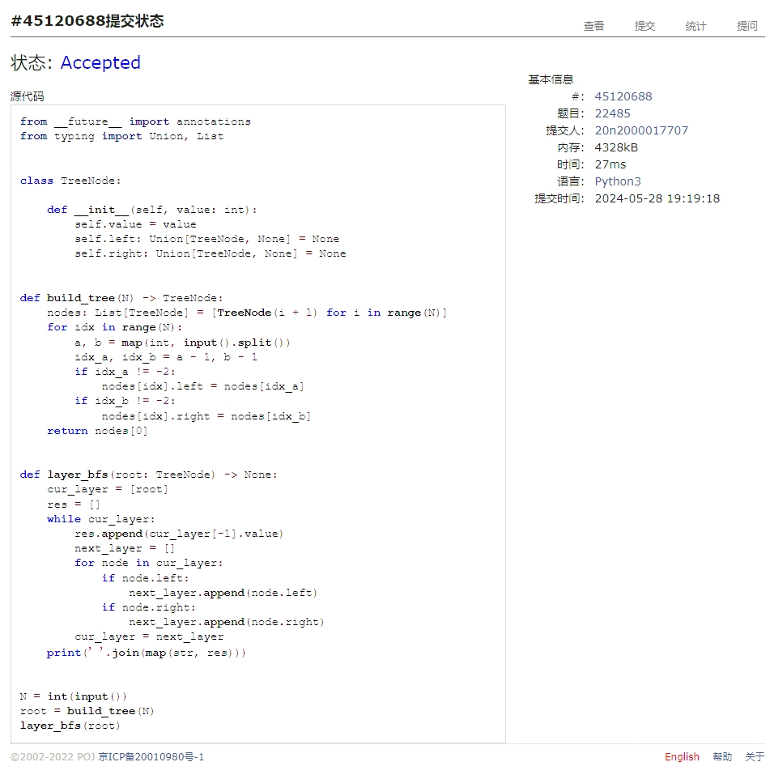
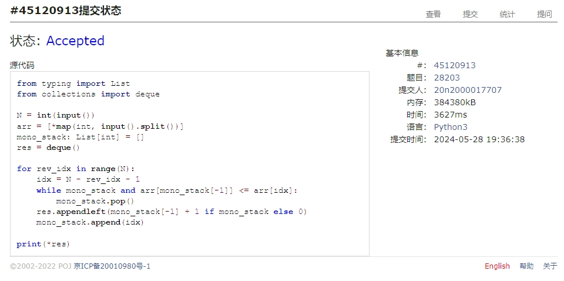
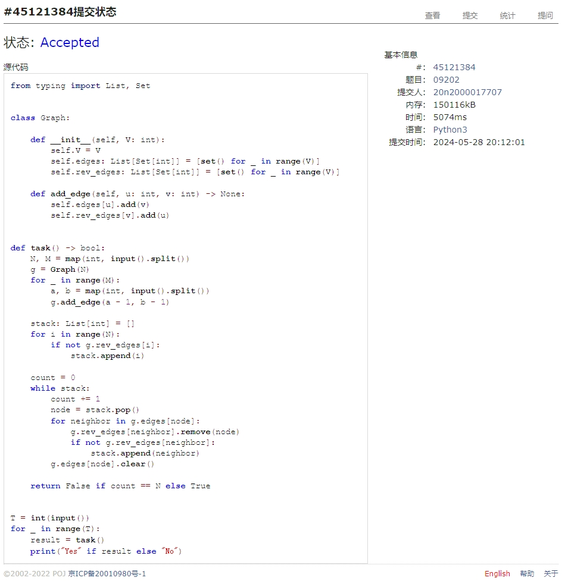
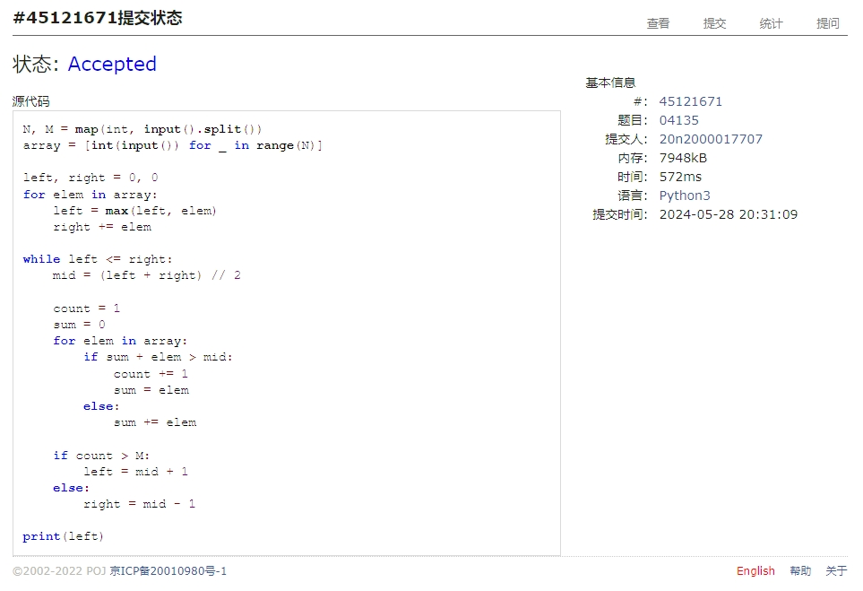
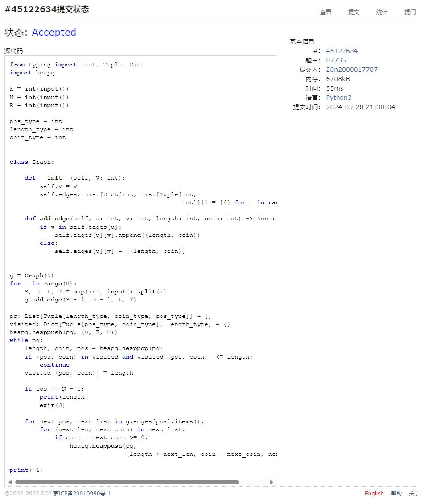
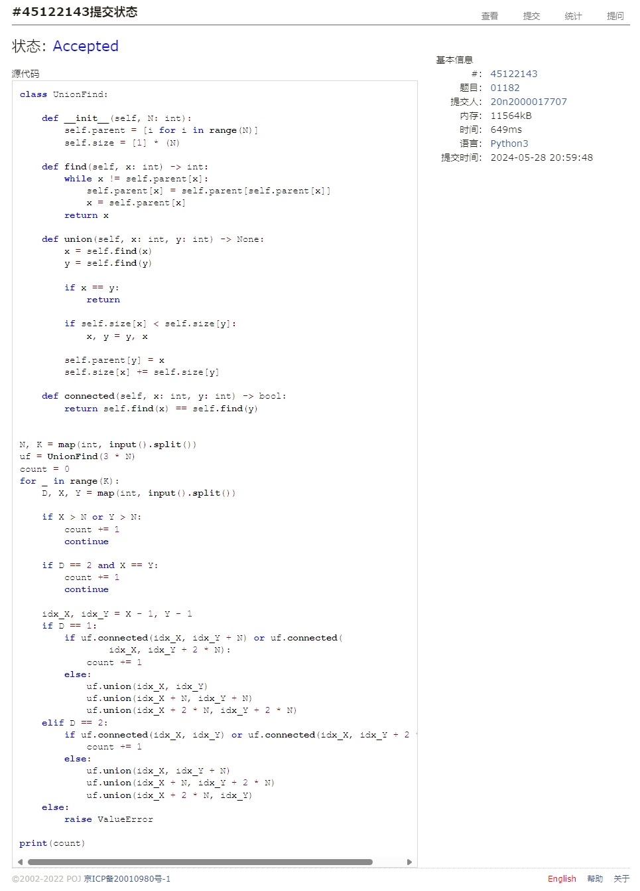

# Assignment #F: All-Killed 满分

Updated 1844 GMT+8 May 20, 2024

2024 spring, Complied by Cat2Li

**说明：**

1）请把每个题目解题思路（可选），源码Python, 或者C++（已经在Codeforces/Openjudge上AC），截图（包含Accepted），填写到下面作业模版中（推荐使用 typora <https://typoraio.cn> ，或者用word）。AC 或者没有AC，都请标上每个题目大致花费时间。

2）提交时候先提交pdf文件，再把md或者doc文件上传到右侧“作业评论”。Canvas需要有同学清晰头像、提交文件有pdf、"作业评论"区有上传的md或者doc附件。

3）如果不能在截止前提交作业，请写明原因。

**编程环境**

==（请改为同学的操作系统、编程环境等）==

操作系统：Ubuntu 22.04.4 LTS

Python编程环境：VS Code 1.89.0; Python 3.12.3

C/C++编程环境：VS Code 1.89.0; gcc (Ubuntu 11.4.0-1ubuntu1~22.04) 11.4.0

## 1. 题目

### 22485: 升空的焰火，从侧面看

<http://cs101.openjudge.cn/practice/22485/>

思路：

代码

```python
from __future__ import annotations
from typing import Union, List


class TreeNode:

    def __init__(self, value: int):
        self.value = value
        self.left: Union[TreeNode, None] = None
        self.right: Union[TreeNode, None] = None


def build_tree(N) -> TreeNode:
    nodes: List[TreeNode] = [TreeNode(i + 1) for i in range(N)]
    for idx in range(N):
        a, b = map(int, input().split())
        idx_a, idx_b = a - 1, b - 1
        if idx_a != -2:
            nodes[idx].left = nodes[idx_a]
        if idx_b != -2:
            nodes[idx].right = nodes[idx_b]
    return nodes[0]


def layer_bfs(root: TreeNode) -> None:
    cur_layer = [root]
    res = []
    while cur_layer:
        res.append(cur_layer[-1].value)
        next_layer = []
        for node in cur_layer:
            if node.left:
                next_layer.append(node.left)
            if node.right:
                next_layer.append(node.right)
        cur_layer = next_layer
    print(' '.join(map(str, res)))


N = int(input())
root = build_tree(N)
layer_bfs(root)
```

代码运行截图 ==（至少包含有"Accepted"）==


### 28203:【模板】单调栈

<http://cs101.openjudge.cn/practice/28203/>

思路：

代码

```python
from typing import List
from collections import deque

N = int(input())
arr = [*map(int, input().split())]
mono_stack: List[int] = []
res = deque()

for rev_idx in range(N):
    idx = N - rev_idx - 1
    while mono_stack and arr[mono_stack[-1]] <= arr[idx]:
        mono_stack.pop()
    res.appendleft(mono_stack[-1] + 1 if mono_stack else 0)
    mono_stack.append(idx)

print(*res)
```

代码运行截图 ==（至少包含有"Accepted"）==


### 09202: 舰队、海域出击

<http://cs101.openjudge.cn/practice/09202/>

思路：

代码

```python
from typing import List, Set


class Graph:

    def __init__(self, V: int):
        self.V = V
        self.edges: List[Set[int]] = [set() for _ in range(V)]
        self.rev_edges: List[Set[int]] = [set() for _ in range(V)]

    def add_edge(self, u: int, v: int) -> None:
        self.edges[u].add(v)
        self.rev_edges[v].add(u)


def task() -> bool:
    N, M = map(int, input().split())
    g = Graph(N)
    for _ in range(M):
        a, b = map(int, input().split())
        g.add_edge(a - 1, b - 1)

    stack: List[int] = []
    for i in range(N):
        if not g.rev_edges[i]:
            stack.append(i)

    count = 0
    while stack:
        count += 1
        node = stack.pop()
        for neighbor in g.edges[node]:
            g.rev_edges[neighbor].remove(node)
            if not g.rev_edges[neighbor]:
                stack.append(neighbor)
        g.edges[node].clear()

    return False if count == N else True


T = int(input())
for _ in range(T):
    result = task()
    print("Yes" if result else "No")
```

代码运行截图 ==（AC代码截图，至少包含有"Accepted"）==


### 04135: 月度开销

<http://cs101.openjudge.cn/practice/04135/>

思路：

代码

```python
N, M = map(int, input().split())
array = [int(input()) for _ in range(N)]

left, right = 0, 0
for elem in array:
    left = max(left, elem)
    right += elem

while left <= right:
    mid = (left + right) // 2

    count = 1
    sum = 0
    for elem in array:
        if sum + elem > mid:
            count += 1
            sum = elem
        else:
            sum += elem

    if count > M:
        left = mid + 1
    else:
        right = mid - 1

print(left)
```

代码运行截图 ==（AC代码截图，至少包含有"Accepted"）==


### 07735: 道路

<http://cs101.openjudge.cn/practice/07735/>

思路：

代码

```python
from typing import List, Tuple, Dict
import heapq

K = int(input())
N = int(input())
R = int(input())

pos_type = int
length_type = int
coin_type = int

class Graph:

    def __init__(self, V: int):
        self.V = V
        self.edges: List[Dict[int, List[Tuple[int,
                                              int]]]] = [{} for _ in range(V)]

    def add_edge(self, u: int, v: int, length: int, coin: int) -> None:
        if v in self.edges[u]:
            self.edges[u][v].append((length, coin))
        else:
            self.edges[u][v] = [(length, coin)]


g = Graph(N)
for _ in range(R):
    S, D, L, T = map(int, input().split())
    g.add_edge(S - 1, D - 1, L, T)

pq: List[Tuple[length_type, coin_type, pos_type]] = []
visited: Dict[Tuple[pos_type, coin_type], length_type] = {}
heapq.heappush(pq, (0, K, 0))
while pq:
    length, coin, pos = heapq.heappop(pq)
    if (pos, coin) in visited and visited[(pos, coin)] <= length:
        continue
    visited[(pos, coin)] = length

    if pos == N - 1:
        print(length)
        exit(0)

    for next_pos, next_list in g.edges[pos].items():
        for (next_len, next_coin) in next_list:
            if coin - next_coin >= 0:
                heapq.heappush(pq,
                               (length + next_len, coin - next_coin, next_pos))

print(-1)
```

代码运行截图 ==（AC代码截图，至少包含有"Accepted"）==



### 01182: 食物链

<http://cs101.openjudge.cn/practice/01182/>

思路：

代码

```python
class UnionFind:

    def __init__(self, N: int):
        self.parent = [i for i in range(N)]
        self.size = [1] * (N)

    def find(self, x: int) -> int:
        while x != self.parent[x]:
            self.parent[x] = self.parent[self.parent[x]]
            x = self.parent[x]
        return x

    def union(self, x: int, y: int) -> None:
        x = self.find(x)
        y = self.find(y)

        if x == y:
            return

        if self.size[x] < self.size[y]:
            x, y = y, x

        self.parent[y] = x
        self.size[x] += self.size[y]

    def connected(self, x: int, y: int) -> bool:
        return self.find(x) == self.find(y)


N, K = map(int, input().split())
uf = UnionFind(3 * N)
count = 0
for _ in range(K):
    D, X, Y = map(int, input().split())

    if X > N or Y > N:
        count += 1
        continue

    if D == 2 and X == Y:
        count += 1
        continue

    idx_X, idx_Y = X - 1, Y - 1
    if D == 1:
        if uf.connected(idx_X, idx_Y + N) or uf.connected(
                idx_X, idx_Y + 2 * N):
            count += 1
        else:
            uf.union(idx_X, idx_Y)
            uf.union(idx_X + N, idx_Y + N)
            uf.union(idx_X + 2 * N, idx_Y + 2 * N)
    elif D == 2:
        if uf.connected(idx_X, idx_Y) or uf.connected(idx_X, idx_Y + 2 * N):
            count += 1
        else:
            uf.union(idx_X, idx_Y + N)
            uf.union(idx_X + N, idx_Y + 2 * N)
            uf.union(idx_X + 2 * N, idx_Y)
    else:
        raise ValueError

print(count)
```

代码运行截图 ==（AC代码截图，至少包含有"Accepted"）==


## 2. 学习总结和收获

==如果作业题目简单，有否额外练习题目，比如：OJ“2024spring每日选做”、CF、LeetCode、洛谷等网站题目。==
07735 就是鸣人与佐助，第一次见到写了很久，第二次见就秒了（）
01182 学习了种类并查集
04135 体会了二分查找的妙用
诶，都是好题，收获很大，但考试遇到如果卡壳就寄了！
